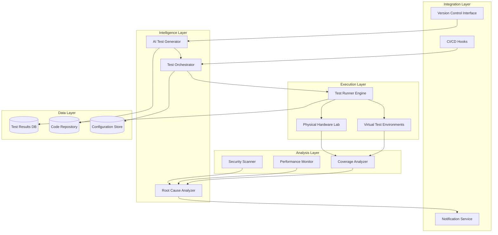

# Design Document: Agentic AI Testing System for Linux Kernel and BSP

## Overview

The Agentic AI Testing System is a sophisticated autonomous testing platform that combines AI-driven test generation, multi-environment execution, and intelligent analysis to comprehensively test Linux kernels and Board Support Packages. The system uses Large Language Models (LLMs) for code understanding and test generation, property-based testing for comprehensive coverage, and distributed execution across virtual and physical hardware environments.

**Supported LLM Providers:**
- OpenAI (GPT-4, GPT-3.5-turbo)
- Anthropic (Claude 3.5 Sonnet, Claude 3 Opus)
- Amazon Bedrock (Claude via Bedrock, Amazon Titan)
- **Amazon Q Developer Pro** (AWS's AI-powered coding assistant)
- **Kiro AI** (AI-powered IDE with autonomous capabilities)

**Authentication Methods:**
- API Keys (traditional)
- **AWS SSO / IAM Identity Center** (for Amazon Q)
- **OAuth2/OIDC SSO** (for Kiro)
- AWS CLI Profiles

The architecture follows a modular design with clear separation between:
- **Intelligence Layer**: AI agents for test generation, analysis, and decision-making
- **Execution Layer**: Test runners, environment managers, and result collectors
- **Analysis Layer**: Coverage tracking, root cause analysis, and reporting
- **Integration Layer**: CI/CD hooks, version control integration, and notification systems
- **Authentication Layer**: SSO providers for secure, centralized authentication

## Architecture

### High-Level Architecture



### Component Interaction Flow

1. **Code Change Detection**: Version control interface detects commits/PRs
2. **AI Analysis**: Test generator analyzes changes using LLM-based code understanding
3. **Test Generation**: System generates targeted test cases based on code changes
4. **Test Orchestration**: Orchestrator schedules tests across available environments
5. **Execution**: Tests run in parallel across virtual and physical environments
6. **Collection**: Results, logs, and coverage data are collected
7. **Analysis**: AI analyzer processes results, identifies patterns, and performs root cause analysis
8. **Reporting**: Results are reported back to developers with actionable insights

## Components and Interfaces

### 1. AI Test Generator

**Responsibilities:**
- Analyze code changes using static analysis and LLM-based understanding
- Generate test cases targeting modified code paths
- Create property-based test specifications
- Generate fuzzing inputs for security testing

**Interfaces:**
```python
class AITestGenerator:
    def analyze_code_changes(self, diff: CodeDiff) -> CodeAnalysis
    def generate_test_cases(self, analysis: CodeAnalysis) -> List[TestCase]
    def generate_property_tests(self, functions: List[Function]) -> List[PropertyTest]
    def generate_fuzz_inputs(self, interface: APIInterface) -> FuzzingStrategy
```

**Key Algorithms:**
- LLM-based code understanding using context from kernel subsystem documentation
- Abstract Syntax Tree (AST) analysis for identifying affected code paths
- Symbolic execution for path exploration
- Template-based test generation with AI-driven parameter selection

### 2. Test Orchestrator

**Responsibilities:**
- Schedule test execution across available resources
- Prioritize tests based on code change impact
- Manage test execution lifecycle
- Handle test retries and failure recovery

**Interfaces:**
```python
class TestOrchestrator:
    def schedule_tests(self, tests: List[TestCase], priority: Priority) -> TestPlan
    def execute_plan(self, plan: TestPlan) -> ExecutionHandle
    def monitor_execution(self, handle: ExecutionHandle) -> ExecutionStatus
    def cancel_execution(self, handle: ExecutionHandle) -> None
```

**Scheduling Algorithm:**
- Priority queue based on: code change impact score, test execution time, resource availability
- Bin packing algorithm for optimal resource utilization
- Dynamic rescheduling based on test results (fail-fast for critical issues)

### 3. Test Execution Environment Manager

**Responsibilities:**
- Provision and manage virtual test environments (QEMU, KVM)
- Interface with physical hardware test lab
- Ensure environment isolation and cleanup
- Capture execution artifacts (logs, core dumps, traces)

**Interfaces:**
```python
class EnvironmentManager:
    def provision_environment(self, config: HardwareConfig) -> Environment
    def deploy_kernel(self, env: Environment, kernel: KernelImage) -> None
    def execute_test(self, env: Environment, test: TestCase) -> TestResult
    def cleanup_environment(self, env: Environment) -> None
    def capture_artifacts(self, env: Environment) -> ArtifactBundle
```

**Environment Types:**
- QEMU virtual machines for x86_64, ARM, RISC-V architectures
- KVM for performance-sensitive tests
- Physical hardware boards in test lab (Raspberry Pi, embedded boards)
  - SSH-based test execution for normal testing
  - Serial console (telnet) execution for early boot testing and kernel debugging
- Container-based environments for userspace testing

### 4. Coverage Analyzer

**Responsibilities:**
- Collect code coverage data from test executions
- Identify untested code paths
- Track coverage trends over time
- Generate coverage reports and visualizations

**Interfaces:**
```python
class CoverageAnalyzer:
    def collect_coverage(self, test_result: TestResult) -> CoverageData
    def merge_coverage(self, data_list: List[CoverageData]) -> CoverageData
    def identify_gaps(self, coverage: CoverageData) -> List[CodePath]
    def generate_report(self, coverage: CoverageData) -> CoverageReport
    def compare_coverage(self, baseline: CoverageData, current: CoverageData) -> CoverageDiff
```

**Coverage Metrics:**
- Line coverage using gcov/lcov
- Branch coverage for conditional logic
- Function coverage for API testing
- Path coverage for critical subsystems

### 5. Root Cause Analyzer

**Responsibilities:**
- Analyze test failures using AI-powered pattern recognition
- Correlate failures with code changes using git bisect
- Group related failures
- Generate actionable failure reports with suggested fixes

**Interfaces:**
```python
class RootCauseAnalyzer:
    def analyze_failure(self, failure: TestFailure) -> FailureAnalysis
    def correlate_with_changes(self, failure: TestFailure, commits: List[Commit]) -> List[SuspiciousCommit]
    def group_failures(self, failures: List[TestFailure]) -> List[FailureGroup]
    def suggest_fixes(self, analysis: FailureAnalysis) -> List[FixSuggestion]
```

**Analysis Techniques:**
- LLM-based log analysis for error pattern recognition
- Stack trace analysis and symbolication
- Git bisect automation for regression identification
- Historical failure database for pattern matching

### 6. Security Scanner

**Responsibilities:**
- Perform static analysis for vulnerability detection
- Execute fuzzing campaigns on kernel interfaces
- Minimize crashing inputs
- Classify security issues by severity

**Interfaces:**
```python
class SecurityScanner:
    def static_analysis(self, code: SourceCode) -> List[SecurityIssue]
    def fuzz_interface(self, interface: APIInterface, strategy: FuzzingStrategy) -> FuzzingResults
    def minimize_crash(self, crash_input: bytes) -> bytes
    def classify_vulnerability(self, issue: SecurityIssue) -> VulnerabilityReport
```

**Tools Integration:**
- Syzkaller for kernel fuzzing
- Coccinelle for static analysis patterns
- AddressSanitizer (KASAN) for memory error detection
- ThreadSanitizer (KTSAN) for race condition detection

### 7. Performance Monitor

**Responsibilities:**
- Execute performance benchmarks
- Compare results against baselines
- Detect performance regressions
- Generate profiling data for analysis

**Interfaces:**
```python
class PerformanceMonitor:
    def run_benchmarks(self, kernel: KernelImage, suite: BenchmarkSuite) -> BenchmarkResults
    def compare_with_baseline(self, results: BenchmarkResults, baseline: BenchmarkResults) -> PerformanceDiff
    def detect_regressions(self, diff: PerformanceDiff, threshold: float) -> List[Regression]
    def profile_kernel(self, kernel: KernelImage, workload: Workload) -> ProfileData
```

**Benchmark Suites:**
- LMBench for system call latency
- FIO for I/O performance
- Netperf for network throughput
- Custom microbenchmarks for specific subsystems

### 8. CI/CD Integration

**Responsibilities:**
- Hook into version control events (commits, PRs)
- Report test results back to VCS
- Trigger builds and test runs
- Send notifications to developers

**Interfaces:**
```python
class CICDIntegration:
    def register_webhook(self, repo: Repository, events: List[EventType]) -> None
    def handle_event(self, event: VCSEvent) -> None
    def report_status(self, pr: PullRequest, status: TestStatus) -> None
    def send_notification(self, recipients: List[Developer], message: Notification) -> None
```

**Supported Platforms:**
- GitHub Actions
- GitLab CI
- Jenkins
- Custom webhook handlers

## Data Models

### TestCase
```python
@dataclass
class TestCase:
    id: str
    name: str
    description: str
    test_type: TestType  # unit, integration, fuzz, performance, security
    target_subsystem: str
    code_paths: List[str]
    execution_time_estimate: int  # seconds
    required_hardware: HardwareConfig
    test_script: str
    expected_outcome: ExpectedOutcome
    metadata: Dict[str, Any]
```

### TestResult
```python
@dataclass
class TestResult:
    test_id: str
    status: TestStatus  # passed, failed, skipped, timeout, error
    execution_time: float
    environment: Environment
    artifacts: ArtifactBundle
    coverage_data: Optional[CoverageData]
    failure_info: Optional[FailureInfo]
    timestamp: datetime
```

### CodeAnalysis
```python
@dataclass
class CodeAnalysis:
    changed_files: List[str]
    changed_functions: List[Function]
    affected_subsystems: List[str]
    impact_score: float  # 0.0 to 1.0
    risk_level: RiskLevel  # low, medium, high, critical
    suggested_test_types: List[TestType]
    related_tests: List[str]  # existing tests that should be re-run
```

### FailureAnalysis
```python
@dataclass
class FailureAnalysis:
    failure_id: str
    root_cause: str
    confidence: float  # 0.0 to 1.0
    suspicious_commits: List[Commit]
    error_pattern: str
    stack_trace: Optional[str]
    suggested_fixes: List[FixSuggestion]
    related_failures: List[str]
    reproducibility: float  # 0.0 to 1.0
```

### HardwareConfig
```python
@dataclass
class HardwareConfig:
    architecture: str  # x86_64, arm64, riscv64
    cpu_model: str
    memory_mb: int
    storage_type: str
    peripherals: List[Peripheral]
    is_virtual: bool
    emulator: Optional[str]  # qemu, kvm, etc.
```

### Environment
```python
@dataclass
class Environment:
    id: str
    config: HardwareConfig
    status: EnvironmentStatus  # idle, busy, provisioning, error
    kernel_version: Optional[str]
    ip_address: Optional[str]
    ssh_credentials: Optional[Credentials]
    created_at: datetime
    last_used: datetime
```

## Correctness Properties

*A property is a characteristic or behavior that should hold true across all valid executions of a system—essentially, a formal statement about what the system should do. Properties serve as the bridge between human-readable specifications and machine-verifiable correctness guarantees.*

### Property 1: Test generation time bound
*For any* code change committed by a developer, the system should analyze the code and generate relevant test cases within 5 minutes of the commit.
**Validates: Requirements 1.1**

### Property 2: Subsystem targeting accuracy
*For any* code change, the generated test cases should target the specific subsystems affected by that change, with no tests targeting unaffected subsystems.
**Validates: Requirements 1.2**

### Property 3: API test coverage completeness
*For any* code change that introduces a new system call or API, the generated test cases should include tests for normal usage, boundary conditions, and error paths.
**Validates: Requirements 1.3**

### Property 4: Test generation quantity
*For any* modified function in a code change, the system should generate at least 10 distinct test cases targeting that function.
**Validates: Requirements 1.4**

### Property 5: Test summary organization
*For any* completed test generation, the summary should organize tests by subsystem and test type, with all generated tests appearing in the appropriate categories.
**Validates: Requirements 1.5**

### Property 6: Hardware matrix coverage
*For any* BSP test execution, tests should run on all hardware targets configured in the test matrix, with no configured target being skipped.
**Validates: Requirements 2.1**

### Property 7: Result aggregation structure
*For any* multi-hardware test execution, results should be aggregated by architecture, board type, and peripheral configuration, with all dimensions represented.
**Validates: Requirements 2.2**

### Property 8: Hardware failure isolation
*For any* hardware-specific test failure, the diagnostic information should uniquely identify the failing hardware configuration.
**Validates: Requirements 2.3**

### Property 9: Compatibility matrix completeness
*For any* completed BSP test run, the compatibility matrix should show pass/fail status for every hardware configuration in the test matrix.
**Validates: Requirements 2.4**

### Property 10: Virtual environment preference
*For any* test that can run on both virtual and physical hardware, the system should execute on virtual hardware first when both are available.
**Validates: Requirements 2.5**

### Property 11: Fault injection diversity
*For any* stress test execution, the injected faults should include all specified types: memory allocation failures, I/O errors, and timing variations.
**Validates: Requirements 3.1**

### Property 12: Fault detection completeness
*For any* test execution with fault injection active, the system should detect and report all kernel crashes, hangs, memory leaks, and data corruption that occur.
**Validates: Requirements 3.2**

### Property 13: Concurrency testing variation
*For any* test of code with suspected race conditions, the system should vary execution timing and thread scheduling across multiple test runs.
**Validates: Requirements 3.3**

### Property 14: Issue reproducibility
*For any* issue discovered during stress testing, the reported test case should reliably reproduce the issue when executed again.
**Validates: Requirements 3.4**

### Property 15: Stress test isolation
*For any* fault injection test execution, no effects should propagate outside the test environment to other systems or tests.
**Validates: Requirements 3.5**

### Property 16: Diagnostic capture completeness
*For any* test failure, the captured diagnostics should include kernel logs, stack traces, and system state.
**Validates: Requirements 4.1**

### Property 17: Failure correlation accuracy
*For any* test failure, the analysis should correlate the failure with recent code changes and identify likely culprit commits.
**Validates: Requirements 4.2**

### Property 18: Failure grouping consistency
*For any* set of test failures with the same root cause, the system should group them together and identify the common root cause.
**Validates: Requirements 4.3**

### Property 19: Root cause report completeness
*For any* completed root cause analysis, the report should include failure description, affected code paths, and suggested fixes.
**Validates: Requirements 4.4**

### Property 20: Historical pattern matching
*For any* failure that matches a known pattern, the analysis should reference similar historical issues and their resolutions.
**Validates: Requirements 4.5**

### Property 21: VCS trigger responsiveness
*For any* version control event (pull request, commit, or branch update), the system should trigger a test run automatically.
**Validates: Requirements 5.1**

### Property 22: Result reporting completeness
*For any* completed test run, the system should report results to the version control system with pass/fail status and detailed logs.
**Validates: Requirements 5.2**

### Property 23: Build integration automation
*For any* newly built kernel image or BSP package, the system should automatically initiate testing without manual intervention.
**Validates: Requirements 5.3**

### Property 24: Critical failure notification
*For any* detected critical failure, the system should send notifications to relevant developers via all configured channels.
**Validates: Requirements 5.4**

### Property 25: Queue prioritization correctness
*For any* set of queued test runs, the execution order should respect both code change impact scores and developer-specified priority levels.
**Validates: Requirements 5.5**

### Property 26: Coverage metric completeness
*For any* test execution, the collected coverage data should include line coverage, branch coverage, and function coverage.
**Validates: Requirements 6.1**

### Property 27: Coverage gap identification accuracy
*For any* coverage analysis, all code paths not exercised by any test should be identified and reported.
**Validates: Requirements 6.2**

### Property 28: Gap-targeted test generation
*For any* identified untested code path, the system should generate additional test cases specifically targeting that path.
**Validates: Requirements 6.3**

### Property 29: Coverage regression detection
*For any* coverage analysis, the system should detect and report when coverage decreases compared to previous measurements.
**Validates: Requirements 6.4**

### Property 30: Coverage visualization completeness
*For any* coverage results display, the visualization should clearly show both covered and uncovered code regions.
**Validates: Requirements 6.5**

### Property 31: Fuzzing target coverage
*For any* security testing execution, fuzzing should be performed on system call interfaces, ioctl handlers, and network protocol parsers.
**Validates: Requirements 7.1**

### Property 32: Crash input minimization
*For any* crash or hang discovered during fuzzing, the system should capture the triggering input and minimize it to the smallest reproducing case.
**Validates: Requirements 7.2**

### Property 33: Vulnerability pattern detection
*For any* static analysis execution, the system should detect common vulnerability patterns including buffer overflows, use-after-free, and integer overflows.
**Validates: Requirements 7.3**

### Property 34: Security issue classification
*For any* detected security issue, the classification should include severity level and exploitability assessment.
**Validates: Requirements 7.4**

### Property 35: Security report completeness
*For any* completed security testing, the report should include all findings, proof-of-concept exploits where applicable, and remediation recommendations.
**Validates: Requirements 7.5**

### Property 36: Performance metric coverage
*For any* performance testing execution, benchmarks should measure throughput, latency, and resource utilization.
**Validates: Requirements 8.1**

### Property 37: Baseline comparison execution
*For any* collected benchmark results, the system should compare them against baseline measurements from previous kernel versions.
**Validates: Requirements 8.2**

### Property 38: Regression detection and attribution
*For any* performance degradation exceeding configured thresholds, the system should flag it as a regression and identify the commit range that introduced it.
**Validates: Requirements 8.3**

### Property 39: Regression profiling data
*For any* detected performance regression, the system should provide profiling data showing where additional time or resources are consumed.
**Validates: Requirements 8.4**

### Property 40: Performance trend reporting
*For any* completed performance testing, the system should generate trend reports showing metrics over time.
**Validates: Requirements 8.5**

### Property 41: Configuration combination coverage
*For any* configuration testing execution, the system should test minimal, default, and maximal kernel configurations.
**Validates: Requirements 9.1**

### Property 42: Configuration build verification
*For any* tested kernel configuration, the system should verify successful build completion without errors or warnings.
**Validates: Requirements 9.2**

### Property 43: Configuration boot verification
*For any* successfully built kernel configuration, the system should boot it and verify basic functionality.
**Validates: Requirements 9.3**

### Property 44: Configuration conflict reporting
*For any* detected configuration conflict, the system should report the incompatible option combinations and suggest resolutions.
**Validates: Requirements 9.4**

### Property 45: Configuration usage analysis
*For any* completed configuration testing, the system should identify configuration options that are untested or rarely used.
**Validates: Requirements 9.5**

### Property 46: Resource distribution optimization
*For any* set of queued test jobs, the scheduler should distribute them across available execution environments to maximize throughput.
**Validates: Requirements 10.1**

### Property 47: Idle resource cleanup
*For any* test execution environment that becomes idle, the system should release or power down the resource to minimize costs.
**Validates: Requirements 10.2**

### Property 48: Priority-based scheduling under contention
*For any* situation where test demand exceeds available resources, the system should prioritize critical tests and defer lower-priority tests.
**Validates: Requirements 10.3**

### Property 49: Environment cleanup completeness
*For any* completed test (passed or failed), the test environment should be cleaned up and prepared for subsequent test runs.
**Validates: Requirements 10.4**

### Property 50: Resource metrics collection
*For any* active resource monitoring, the system should collect metrics on test execution time, resource consumption, and queue wait times.
**Validates: Requirements 10.5**

## Error Handling

### Test Generation Errors
- **LLM API Failures**: Retry with exponential backoff; fall back to template-based generation if LLM unavailable
- **Code Analysis Errors**: Log error, skip problematic files, continue with remaining files
- **Invalid Test Generation**: Validate generated tests syntactically before scheduling; discard invalid tests

### Execution Errors
- **Environment Provisioning Failures**: Retry up to 3 times; mark environment as unhealthy if persistent
- **Test Timeouts**: Kill test process, capture partial results, mark as timeout
- **Kernel Panics**: Capture crash dump, reboot environment, mark test as failed with panic info
- **Network Failures**: Retry test execution; use local caching where possible

### Analysis Errors
- **Coverage Collection Failures**: Log warning, continue without coverage data for that test
- **Root Cause Analysis Failures**: Provide raw failure data to developer without AI analysis
- **Performance Baseline Missing**: Use current run as new baseline; warn user

### Integration Errors
- **VCS API Failures**: Queue status updates for retry; send email notification as fallback
- **Notification Delivery Failures**: Log failed notifications; retry with exponential backoff
- **Database Connection Errors**: Use local caching; sync when connection restored

### Recovery Strategies
- **Graceful Degradation**: System continues operating with reduced functionality when components fail
- **Automatic Retry**: Transient failures are retried with exponential backoff
- **Circuit Breaker**: Failing components are temporarily disabled to prevent cascade failures
- **Manual Intervention**: Critical failures trigger alerts for human intervention

## Testing Strategy

### Unit Testing Approach

Unit tests will validate individual components in isolation:

- **AI Test Generator**: Test code analysis logic with sample diffs; verify test case generation produces valid test structures
- **Test Orchestrator**: Test scheduling algorithms with mock test cases; verify priority handling
- **Environment Manager**: Test environment lifecycle with mock provisioning; verify cleanup logic
- **Coverage Analyzer**: Test coverage merging and gap identification with sample coverage data
- **Root Cause Analyzer**: Test failure grouping and pattern matching with known failure examples

Unit tests will use pytest framework with mocking for external dependencies (LLM APIs, hardware interfaces, databases).

### Property-Based Testing Approach

Property-based tests will verify universal properties across all inputs using the Hypothesis library for Python:

- **Test Generation Properties**: Verify completeness, uniqueness, and correctness of generated tests across random code changes
- **Scheduling Properties**: Verify fairness, resource utilization, and priority handling across random test workloads
- **Coverage Properties**: Verify accuracy and completeness of coverage tracking across random test executions
- **Analysis Properties**: Verify consistency of failure grouping and root cause identification across random failure patterns

Each property-based test will run a minimum of 100 iterations to ensure thorough coverage of the input space. Tests will use custom generators for domain-specific types (code diffs, test cases, hardware configurations).

### Integration Testing

Integration tests will validate component interactions:

- **End-to-End Test Flows**: Simulate complete workflows from code change to test result reporting
- **CI/CD Integration**: Test webhook handling and status reporting with test VCS instances
- **Multi-Environment Execution**: Verify tests execute correctly across different hardware configurations
- **Failure Recovery**: Test system behavior under various failure scenarios

### Security Testing

- **Fuzzing**: Fuzz all external interfaces (APIs, file parsers, configuration readers)
- **Static Analysis**: Run security-focused static analysis on all code
- **Dependency Scanning**: Monitor for vulnerabilities in third-party dependencies

### Performance Testing

- **Load Testing**: Verify system handles high test volumes (1000+ concurrent tests)
- **Scalability Testing**: Test resource scaling as test load increases
- **Latency Testing**: Verify test generation and result reporting meet SLA requirements
