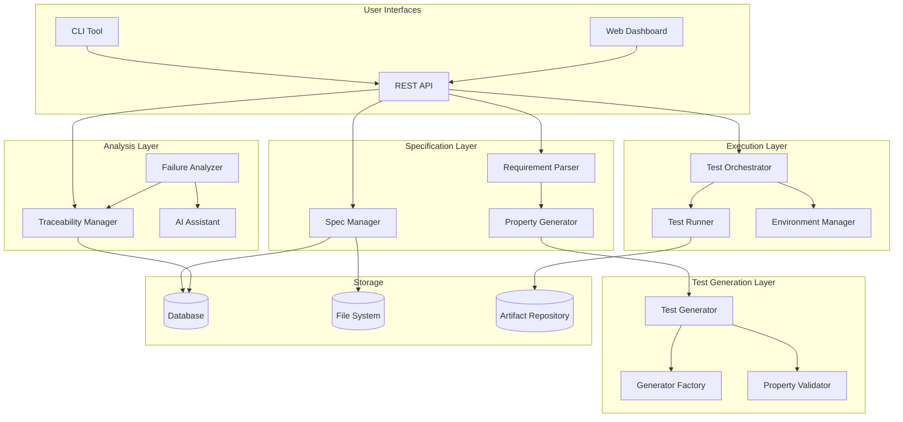

# Agentic AI Test Requirements Design

## Overview

The Agentic AI Test Requirements system provides an end-to-end workflow for transforming formal requirements into executable property-based tests. The system integrates with the existing AI-powered testing infrastructure to provide:

1. **Requirement Parsing** - Extract testable criteria from EARS-formatted requirements
2. **Property Generation** - Create universally quantified correctness properties
3. **Test Generation** - Generate Hypothesis-based property tests with smart generators
4. **Test Execution** - Run tests across QEMU and physical hardware environments
5. **Failure Analysis** - Analyze failures and provide actionable feedback with requirement traceability

The architecture follows the existing project patterns with clear separation between:
- **Presentation Layer**: React components for requirement management UI and CLI
- **API Layer**: FastAPI endpoints for specification and test management
- **Service Layer**: Business logic for parsing, generation, execution, and analysis
- **Infrastructure Layer**: Integration with existing test runners and environments

## Architecture



## Components and Interfaces

### 1. Requirement Parser

Parses EARS-formatted requirements and extracts testable criteria.

```python
class RequirementParser:
    """Parses EARS-formatted requirements into structured representations."""
    
    async def parse_requirement(self, text: str) -> ParsedRequirement:
        """Parse a single EARS requirement.
        
        Args:
            text: EARS-formatted requirement text
            
        Returns:
            ParsedRequirement with trigger, system, and response
        """
        pass
    
    async def parse_specification(self, spec_path: str) -> TestSpecification:
        """Parse a complete test specification file.
        
        Args:
            spec_path: Path to specification file (YAML/JSON)
            
        Returns:
            TestSpecification with all requirements
        """
        pass
    
    async def validate_requirement(self, req: ParsedRequirement) -> ValidationResult:
        """Validate a parsed requirement for completeness and clarity.
        
        Args:
            req: ParsedRequirement to validate
            
        Returns:
            ValidationResult with issues and suggestions
        """
        pass
    
    async def identify_dependencies(self, reqs: List[ParsedRequirement]) -> DependencyGraph:
        """Identify dependencies between requirements.
        
        Args:
            reqs: List of parsed requirements
            
        Returns:
            DependencyGraph showing relationships
        """
        pass
```

### 2. Property Generator

Generates correctness properties from parsed requirements.

```python
class PropertyGenerator:
    """Generates correctness properties from requirements."""
    
    async def generate_properties(self, req: ParsedRequirement) -> List[CorrectnessProperty]:
        """Generate properties from a requirement.
        
        Args:
            req: ParsedRequirement to generate properties for
            
        Returns:
            List of CorrectnessProperty objects
        """
        pass
    
    async def identify_property_pattern(self, req: ParsedRequirement) -> PropertyPattern:
        """Identify the appropriate property pattern.
        
        Args:
            req: ParsedRequirement to analyze
            
        Returns:
            PropertyPattern (INVARIANT, ROUND_TRIP, IDEMPOTENCE, METAMORPHIC)
        """
        pass
    
    async def generate_round_trip_property(self, req: ParsedRequirement) -> CorrectnessProperty:
        """Generate a round-trip property for serialization requirements.
        
        Args:
            req: ParsedRequirement involving data transformation
            
        Returns:
            CorrectnessProperty for round-trip verification
        """
        pass
    
    async def annotate_property(self, prop: CorrectnessProperty, req_id: str) -> CorrectnessProperty:
        """Annotate property with requirement traceability.
        
        Args:
            prop: CorrectnessProperty to annotate
            req_id: Requirement ID for traceability
            
        Returns:
            Annotated CorrectnessProperty
        """
        pass
```

### 3. Test Generator

Generates executable Hypothesis-based tests from properties.

```python
class PropertyTestGenerator:
    """Generates Hypothesis-based property tests."""
    
    async def generate_test(self, prop: CorrectnessProperty) -> GeneratedTest:
        """Generate a property test from a correctness property.
        
        Args:
            prop: CorrectnessProperty to test
            
        Returns:
            GeneratedTest with test code and metadata
        """
        pass
    
    async def generate_test_file(self, props: List[CorrectnessProperty], output_path: str) -> str:
        """Generate a complete test file for multiple properties.
        
        Args:
            props: List of properties to test
            output_path: Path to write test file
            
        Returns:
            Path to generated test file
        """
        pass
    
    async def validate_test_syntax(self, test_code: str) -> ValidationResult:
        """Validate generated test code syntax.
        
        Args:
            test_code: Python test code to validate
            
        Returns:
            ValidationResult with any syntax errors
        """
        pass
    
    async def add_traceability_annotations(self, test: GeneratedTest, req_id: str) -> GeneratedTest:
        """Add requirement traceability to test docstring.
        
        Args:
            test: GeneratedTest to annotate
            req_id: Requirement ID for traceability
            
        Returns:
            Annotated GeneratedTest
        """
        pass
```

### 4. Generator Factory

Creates smart Hypothesis strategies for test data generation.

```python
class GeneratorFactory:
    """Creates Hypothesis strategies for property tests."""
    
    def create_generator(self, type_spec: TypeSpecification) -> st.SearchStrategy:
        """Create a generator for a type specification.
        
        Args:
            type_spec: TypeSpecification describing the type
            
        Returns:
            Hypothesis SearchStrategy for the type
        """
        pass
    
    def create_domain_generator(self, domain: str, constraints: Dict[str, Any]) -> st.SearchStrategy:
        """Create a domain-specific generator with constraints.
        
        Args:
            domain: Domain name (e.g., "build_server", "host", "board")
            constraints: Dictionary of constraints
            
        Returns:
            Constrained Hypothesis SearchStrategy
        """
        pass
    
    def compose_generators(self, generators: List[st.SearchStrategy]) -> st.SearchStrategy:
        """Compose multiple generators into a complex strategy.
        
        Args:
            generators: List of strategies to compose
            
        Returns:
            Composed Hypothesis SearchStrategy
        """
        pass
    
    def create_edge_case_generator(self, base_generator: st.SearchStrategy, edge_cases: List[Any]) -> st.SearchStrategy:
        """Create a generator that includes specific edge cases.
        
        Args:
            base_generator: Base strategy
            edge_cases: List of edge case values to include
            
        Returns:
            Strategy that includes edge cases
        """
        pass
```

### 5. Test Orchestrator

Schedules and coordinates test execution.

```python
class PropertyTestOrchestrator:
    """Orchestrates property test execution across environments."""
    
    async def schedule_tests(self, tests: List[GeneratedTest], config: ExecutionConfig) -> ExecutionPlan:
        """Schedule property tests for execution.
        
        Args:
            tests: List of tests to execute
            config: Execution configuration
            
        Returns:
            ExecutionPlan with scheduled tests
        """
        pass
    
    async def execute_plan(self, plan: ExecutionPlan) -> ExecutionResult:
        """Execute a test plan.
        
        Args:
            plan: ExecutionPlan to execute
            
        Returns:
            ExecutionResult with all test results
        """
        pass
    
    async def run_property_test(self, test: GeneratedTest, env: Environment, iterations: int = 100) -> PropertyTestResult:
        """Run a single property test.
        
        Args:
            test: GeneratedTest to run
            env: Environment to run in
            iterations: Number of test iterations
            
        Returns:
            PropertyTestResult with pass/fail and counter-examples
        """
        pass
    
    async def shrink_counter_example(self, test: GeneratedTest, counter_example: Any) -> Any:
        """Shrink a counter-example to minimal failing case.
        
        Args:
            test: GeneratedTest that failed
            counter_example: Original failing input
            
        Returns:
            Minimal failing input
        """
        pass
```

### 6. Failure Analyzer

Analyzes test failures and provides actionable feedback.

```python
class PropertyFailureAnalyzer:
    """Analyzes property test failures."""
    
    async def analyze_failure(self, result: PropertyTestResult) -> FailureAnalysis:
        """Analyze a property test failure.
        
        Args:
            result: PropertyTestResult with failure
            
        Returns:
            FailureAnalysis with root cause and suggestions
        """
        pass
    
    async def correlate_with_requirement(self, result: PropertyTestResult) -> RequirementViolation:
        """Correlate failure with violated requirement.
        
        Args:
            result: PropertyTestResult with failure
            
        Returns:
            RequirementViolation with requirement details
        """
        pass
    
    async def group_failures(self, results: List[PropertyTestResult]) -> Dict[str, List[PropertyTestResult]]:
        """Group related failures by root cause.
        
        Args:
            results: List of failed test results
            
        Returns:
            Dictionary mapping root cause to failures
        """
        pass
    
    async def suggest_fixes(self, analysis: FailureAnalysis) -> List[FixSuggestion]:
        """Suggest fixes based on failure analysis.
        
        Args:
            analysis: FailureAnalysis to generate fixes for
            
        Returns:
            List of suggested fixes
        """
        pass
```

### 7. Traceability Manager

Manages requirement-to-test traceability.

```python
class TraceabilityManager:
    """Manages requirement-to-test traceability."""
    
    async def link_test_to_requirement(self, test_id: str, req_id: str) -> TraceabilityLink:
        """Create a link between test and requirement.
        
        Args:
            test_id: Test identifier
            req_id: Requirement identifier
            
        Returns:
            TraceabilityLink object
        """
        pass
    
    async def get_tests_for_requirement(self, req_id: str) -> List[str]:
        """Get all tests that cover a requirement.
        
        Args:
            req_id: Requirement identifier
            
        Returns:
            List of test identifiers
        """
        pass
    
    async def get_requirement_for_test(self, test_id: str) -> Optional[str]:
        """Get the requirement a test validates.
        
        Args:
            test_id: Test identifier
            
        Returns:
            Requirement identifier or None
        """
        pass
    
    async def generate_coverage_matrix(self, spec_id: str) -> CoverageMatrix:
        """Generate a requirement coverage matrix.
        
        Args:
            spec_id: Specification identifier
            
        Returns:
            CoverageMatrix showing requirements vs tests
        """
        pass
    
    async def find_untested_requirements(self, spec_id: str) -> List[str]:
        """Find requirements without test coverage.
        
        Args:
            spec_id: Specification identifier
            
        Returns:
            List of untested requirement identifiers
        """
        pass
```

### 8. Specification Manager

Manages test specifications as structured documents.

```python
class SpecificationManager:
    """Manages test specifications."""
    
    async def create_specification(self, name: str, requirements: List[ParsedRequirement]) -> TestSpecification:
        """Create a new test specification.
        
        Args:
            name: Specification name
            requirements: List of requirements
            
        Returns:
            Created TestSpecification
        """
        pass
    
    async def update_specification(self, spec_id: str, updates: SpecificationUpdate) -> TestSpecification:
        """Update an existing specification.
        
        Args:
            spec_id: Specification identifier
            updates: Updates to apply
            
        Returns:
            Updated TestSpecification
        """
        pass
    
    async def get_specification(self, spec_id: str) -> TestSpecification:
        """Get a specification by ID.
        
        Args:
            spec_id: Specification identifier
            
        Returns:
            TestSpecification object
        """
        pass
    
    async def export_specification(self, spec_id: str, format: str) -> str:
        """Export specification to a format.
        
        Args:
            spec_id: Specification identifier
            format: Export format (markdown, html, yaml)
            
        Returns:
            Exported content
        """
        pass
    
    async def regenerate_tests(self, spec_id: str) -> List[GeneratedTest]:
        """Regenerate tests for a specification.
        
        Args:
            spec_id: Specification identifier
            
        Returns:
            List of regenerated tests
        """
        pass
```

## Data Models

### Requirement Models

```python
from dataclasses import dataclass, field
from datetime import datetime
from enum import Enum
from typing import List, Dict, Any, Optional

class EARSPattern(Enum):
    """EARS requirement patterns."""
    UBIQUITOUS = "ubiquitous"      # THE system SHALL
    EVENT_DRIVEN = "event_driven"  # WHEN trigger, THE system SHALL
    STATE_DRIVEN = "state_driven"  # WHILE state, THE system SHALL
    UNWANTED = "unwanted"          # IF condition, THEN THE system SHALL
    OPTIONAL = "optional"          # WHERE option, THE system SHALL
    COMPLEX = "complex"            # Combination of patterns

@dataclass
class ParsedRequirement:
    """A parsed EARS requirement."""
    id: str
    text: str
    pattern: EARSPattern
    trigger: Optional[str] = None      # WHEN/IF condition
    state: Optional[str] = None        # WHILE condition
    system: str = ""                   # System name
    response: str = ""                 # SHALL response
    options: Optional[str] = None      # WHERE option
    metadata: Dict[str, Any] = field(default_factory=dict)
    created_at: datetime = field(default_factory=datetime.now)

@dataclass
class ValidationResult:
    """Result of requirement validation."""
    is_valid: bool
    issues: List[str] = field(default_factory=list)
    suggestions: List[str] = field(default_factory=list)
    ambiguities: List[str] = field(default_factory=list)
    undefined_terms: List[str] = field(default_factory=list)

@dataclass
class DependencyGraph:
    """Graph of requirement dependencies."""
    nodes: List[str]  # Requirement IDs
    edges: List[tuple]  # (from_id, to_id, relationship)
    metadata: Dict[str, Any] = field(default_factory=dict)
```

### Property Models

```python
class PropertyPattern(Enum):
    """Common property patterns."""
    INVARIANT = "invariant"           # Property preserved after operation
    ROUND_TRIP = "round_trip"         # encode(decode(x)) == x
    IDEMPOTENCE = "idempotence"       # f(f(x)) == f(x)
    METAMORPHIC = "metamorphic"       # Relationship between inputs/outputs
    MODEL_BASED = "model_based"       # Compare with reference implementation
    CONFLUENCE = "confluence"         # Order independence
    ERROR_CONDITION = "error"         # Error handling verification

@dataclass
class CorrectnessProperty:
    """A correctness property derived from a requirement."""
    id: str
    name: str
    description: str
    pattern: PropertyPattern
    universal_quantifier: str  # "For all X..."
    property_statement: str    # The actual property
    requirement_ids: List[str] = field(default_factory=list)
    input_types: List[str] = field(default_factory=list)
    preconditions: List[str] = field(default_factory=list)
    postconditions: List[str] = field(default_factory=list)
    metadata: Dict[str, Any] = field(default_factory=dict)

@dataclass
class TypeSpecification:
    """Specification for a type used in property tests."""
    name: str
    base_type: str  # int, str, list, dict, custom
    constraints: Dict[str, Any] = field(default_factory=dict)
    examples: List[Any] = field(default_factory=list)
    edge_cases: List[Any] = field(default_factory=list)
```

### Test Models

```python
@dataclass
class GeneratedTest:
    """A generated property-based test."""
    id: str
    name: str
    property_id: str
    requirement_ids: List[str]
    test_code: str
    generators: List[str]  # Generator strategy names
    iterations: int = 100
    timeout_seconds: int = 300
    file_path: Optional[str] = None
    metadata: Dict[str, Any] = field(default_factory=dict)
    created_at: datetime = field(default_factory=datetime.now)

@dataclass
class PropertyTestResult:
    """Result of a property test execution."""
    test_id: str
    property_id: str
    requirement_ids: List[str]
    passed: bool
    iterations_run: int
    counter_example: Optional[Any] = None
    shrunk_example: Optional[Any] = None
    error_message: Optional[str] = None
    execution_time_seconds: float = 0.0
    environment_id: Optional[str] = None
    timestamp: datetime = field(default_factory=datetime.now)
    metadata: Dict[str, Any] = field(default_factory=dict)

@dataclass
class ExecutionConfig:
    """Configuration for test execution."""
    iterations: int = 100
    timeout_seconds: int = 300
    parallel: bool = True
    max_workers: int = 4
    environments: List[str] = field(default_factory=list)
    shrink_on_failure: bool = True
    verbose: bool = False
```

### Specification Models

```python
@dataclass
class TestSpecification:
    """A complete test specification."""
    id: str
    name: str
    description: str
    version: str = "1.0.0"
    requirements: List[ParsedRequirement] = field(default_factory=list)
    properties: List[CorrectnessProperty] = field(default_factory=list)
    tests: List[GeneratedTest] = field(default_factory=list)
    glossary: Dict[str, str] = field(default_factory=dict)
    metadata: Dict[str, Any] = field(default_factory=dict)
    created_at: datetime = field(default_factory=datetime.now)
    updated_at: datetime = field(default_factory=datetime.now)

@dataclass
class SpecificationUpdate:
    """Update to a specification."""
    requirements: Optional[List[ParsedRequirement]] = None
    properties: Optional[List[CorrectnessProperty]] = None
    glossary: Optional[Dict[str, str]] = None
    metadata: Optional[Dict[str, Any]] = None
```

### Traceability Models

```python
@dataclass
class TraceabilityLink:
    """Link between test and requirement."""
    test_id: str
    requirement_id: str
    property_id: Optional[str] = None
    link_type: str = "validates"  # validates, partially_validates, related
    created_at: datetime = field(default_factory=datetime.now)

@dataclass
class CoverageMatrix:
    """Requirement coverage matrix."""
    spec_id: str
    requirements: List[str]
    tests: List[str]
    coverage: Dict[str, List[str]]  # req_id -> [test_ids]
    untested: List[str]
    orphaned_tests: List[str]
    coverage_percentage: float
    generated_at: datetime = field(default_factory=datetime.now)

@dataclass
class RequirementViolation:
    """A requirement violation from a test failure."""
    requirement_id: str
    requirement_text: str
    property_id: str
    property_statement: str
    counter_example: Any
    violation_description: str
    severity: str = "high"  # low, medium, high, critical
```

### Analysis Models

```python
@dataclass
class FailureAnalysis:
    """Analysis of a property test failure."""
    test_id: str
    property_id: str
    requirement_ids: List[str]
    root_cause: str
    counter_example: Any
    shrunk_example: Optional[Any] = None
    violation: Optional[RequirementViolation] = None
    related_failures: List[str] = field(default_factory=list)
    suggested_fixes: List[str] = field(default_factory=list)
    confidence: float = 0.0
    analyzed_at: datetime = field(default_factory=datetime.now)

@dataclass
class FixSuggestion:
    """Suggested fix for a failure."""
    description: str
    code_change: Optional[str] = None
    requirement_change: Optional[str] = None
    confidence: float = 0.0
    rationale: str = ""
```

## Correctness Properties

*A property is a characteristic or behavior that should hold true across all valid executions of a system-essentially, a formal statement about what the system should do. Properties serve as the bridge between human-readable specifications and machine-verifiable correctness guarantees.*

### Property 1: Requirement Parsing Completeness
*For any* valid EARS-formatted requirement, the parser SHALL extract all components (trigger, system, response) without loss of information.
**Validates: Requirements 1.1, 1.5**

### Property 2: Property Generation Traceability
*For any* generated correctness property, there SHALL exist a link to at least one originating requirement.
**Validates: Requirements 2.5, 7.1**

### Property 3: Test Generation Validity
*For any* generated property test, the test code SHALL be syntactically valid Python and executable by pytest.
**Validates: Requirements 3.5**

### Property 4: Generator Constraint Satisfaction
*For any* generated test input, the input SHALL satisfy all constraints specified in the type specification.
**Validates: Requirements 4.3**

### Property 5: Counter-Example Reproducibility
*For any* counter-example from a failed property test, re-running the test with that input SHALL reproduce the failure.
**Validates: Requirements 5.3**

### Property 6: Failure-Requirement Correlation
*For any* property test failure, the analyzer SHALL identify the specific requirement that was violated.
**Validates: Requirements 6.1, 6.2**

### Property 7: Traceability Bidirectionality
*For any* test-requirement link, querying from either direction SHALL return the linked entity.
**Validates: Requirements 7.1, 7.2**

### Property 8: Specification Round-Trip
*For any* test specification, exporting and re-importing SHALL produce an equivalent specification.
**Validates: Requirements 8.1, 8.4**

### Property 9: Test Iteration Minimum
*For any* property test execution, the number of iterations SHALL be at least 100.
**Validates: Requirements 3.3, 5.2**

### Property 10: Coverage Matrix Completeness
*For any* coverage matrix, all requirements in the specification SHALL be represented.
**Validates: Requirements 7.5**

## Error Handling

### Parsing Errors
- Invalid EARS syntax: Return validation result with specific syntax error
- Missing components: Flag incomplete requirement with suggestions
- Undefined terms: List undefined terms and suggest glossary additions

### Generation Errors
- Unsupported property pattern: Fall back to generic property template
- Complex type without generator: Create composite generator from primitives
- Circular dependencies: Detect and report with dependency graph

### Execution Errors
- Test timeout: Record partial results and counter-example if available
- Environment failure: Retry on alternative environment
- Shrinking failure: Return original counter-example

### Analysis Errors
- Unknown failure pattern: Use LLM for analysis with confidence score
- Missing requirement link: Flag as orphaned test
- Correlation failure: Report with available context

## Testing Strategy

### Unit Tests
- Test EARS pattern parsing for each pattern type
- Test property generation for each property pattern
- Test generator creation for each type specification
- Test traceability link operations

### Property-Based Tests
- Property 1: Parsing completeness (round-trip)
- Property 3: Test generation validity (syntax check)
- Property 4: Generator constraint satisfaction
- Property 7: Traceability bidirectionality
- Property 8: Specification round-trip

### Integration Tests
- End-to-end workflow: requirement → property → test → execution → analysis
- API endpoint testing for all CRUD operations
- CLI command testing for all commands
- Dashboard integration testing

## API Endpoints

### Specifications API
```
POST   /api/specifications              - Create specification
GET    /api/specifications              - List specifications
GET    /api/specifications/{id}         - Get specification
PUT    /api/specifications/{id}         - Update specification
DELETE /api/specifications/{id}         - Delete specification
POST   /api/specifications/{id}/export  - Export specification
```

### Requirements API
```
POST   /api/requirements/parse          - Parse EARS requirement
POST   /api/requirements/validate       - Validate requirement
GET    /api/specifications/{id}/requirements - List requirements
```

### Properties API
```
POST   /api/properties/generate         - Generate properties from requirement
GET    /api/specifications/{id}/properties - List properties
```

### Tests API
```
POST   /api/tests/generate              - Generate tests from properties
POST   /api/tests/execute               - Execute property tests
GET    /api/tests/{id}/results          - Get test results
GET    /api/specifications/{id}/tests   - List tests for specification
```

### Traceability API
```
GET    /api/traceability/matrix/{spec_id}     - Get coverage matrix
GET    /api/traceability/requirement/{req_id} - Get tests for requirement
GET    /api/traceability/test/{test_id}       - Get requirement for test
GET    /api/traceability/untested/{spec_id}   - Get untested requirements
```

## CLI Commands

```bash
# Specification management
agentic-test spec create <name> [--template <template>]
agentic-test spec list
agentic-test spec show <spec_id>
agentic-test spec validate <spec_id>
agentic-test spec export <spec_id> [--format markdown|html|yaml]

# Requirement management
agentic-test req parse <text>
agentic-test req add <spec_id> <text>
agentic-test req validate <spec_id>

# Property and test generation
agentic-test generate properties <spec_id>
agentic-test generate tests <spec_id> [--output <path>]

# Test execution
agentic-test run <spec_id> [--iterations 100] [--parallel]
agentic-test run test <test_id>

# Reporting
agentic-test report coverage <spec_id>
agentic-test report failures <spec_id>
agentic-test report traceability <spec_id>
```
