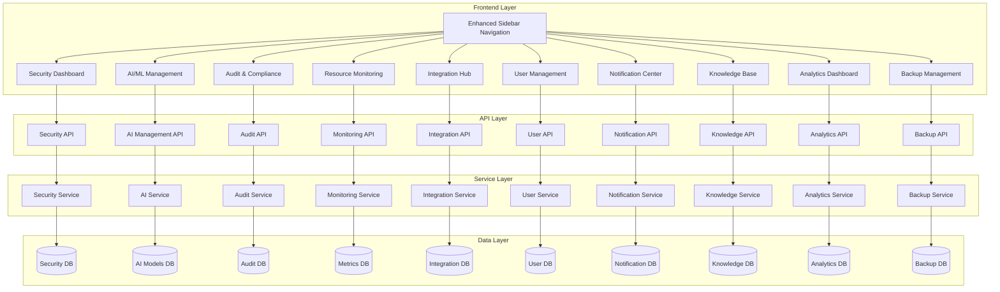
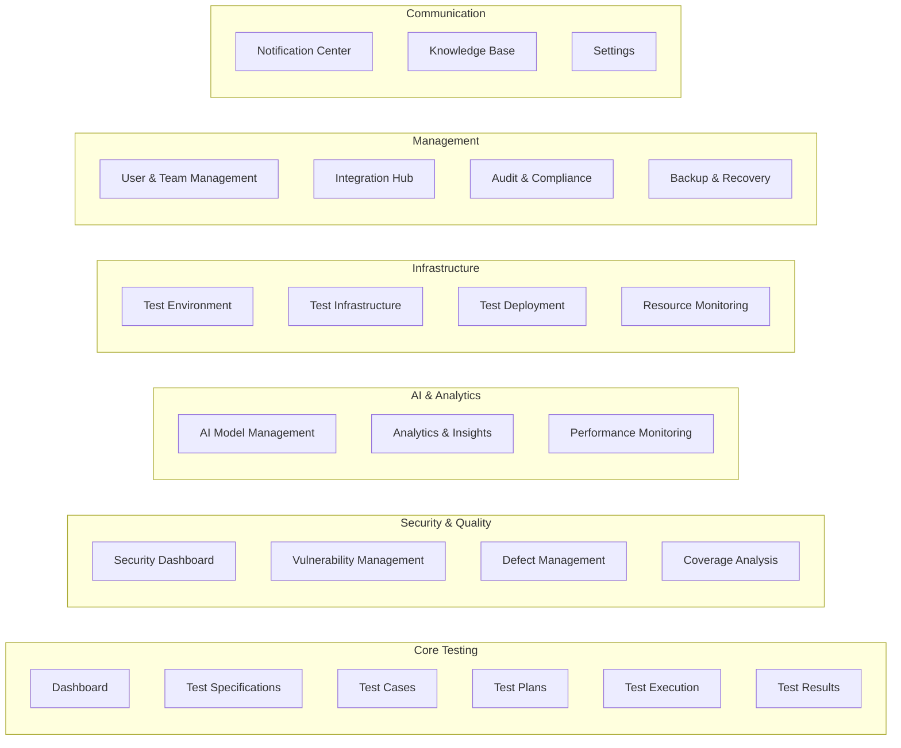

# Missing Sidebar Functionality Design

## Overview

This design document outlines the implementation of comprehensive sidebar navigation enhancements for the Agentic AI Testing System. The design addresses ten critical missing areas: Security & Vulnerability Management, AI/ML Model Management, Audit & Compliance, Resource Monitoring, Integration Management, User & Team Management, Notification Center, Knowledge Base, Analytics & Insights, and Backup & Recovery.

The design follows enterprise dashboard best practices including F-pattern scanning, progressive disclosure, semantic color coding, and responsive design principles. The enhanced sidebar will transform the system from a basic testing platform into a comprehensive enterprise-grade solution.

## Architecture

### High-Level Architecture



### Navigation Architecture

The enhanced sidebar follows a hierarchical grouping pattern with progressive disclosure:



## Components and Interfaces

### 1. Enhanced Sidebar Navigation Component

**Location**: `dashboard/src/components/Layout/EnhancedSidebar.tsx`

```typescript
interface SidebarSection {
  id: string
  title: string
  icon: React.ComponentType
  items: SidebarItem[]
  collapsible: boolean
  defaultCollapsed?: boolean
}

interface SidebarItem {
  key: string
  icon: React.ComponentType
  label: string
  path: string
  badge?: BadgeConfig
  permissions?: string[]
  children?: SidebarItem[]
}

interface BadgeConfig {
  count?: number
  status?: 'success' | 'warning' | 'error' | 'info'
  pulse?: boolean
}

interface EnhancedSidebarProps {
  collapsed: boolean
  onCollapse: (collapsed: boolean) => void
  userPermissions: string[]
  notificationCounts: Record<string, number>
}
```

### 2. Security Dashboard Component

**Location**: `dashboard/src/pages/SecurityDashboard.tsx`

```typescript
interface SecurityMetrics {
  vulnerabilityCount: {
    critical: number
    high: number
    medium: number
    low: number
  }
  complianceScore: number
  activeFuzzingCampaigns: number
  recentFindings: SecurityFinding[]
  securityTrends: SecurityTrend[]
}

interface SecurityFinding {
  id: string
  severity: 'critical' | 'high' | 'medium' | 'low'
  type: 'vulnerability' | 'compliance' | 'fuzzing'
  title: string
  description: string
  affectedComponents: string[]
  discoveredAt: Date
  status: 'open' | 'investigating' | 'resolved' | 'false_positive'
  cveId?: string
  remediation?: string
}
```

### 3. AI Model Management Component

**Location**: `dashboard/src/pages/AIModelManagement.tsx`

```typescript
interface AIModel {
  id: string
  name: string
  provider: 'openai' | 'anthropic' | 'local' | 'custom'
  version: string
  status: 'active' | 'inactive' | 'error' | 'maintenance'
  metrics: ModelMetrics
  configuration: ModelConfiguration
  fallbackModel?: string
}

interface ModelMetrics {
  responseTime: number
  accuracy: number
  tokenUsage: number
  costPerRequest: number
  requestCount: number
  errorRate: number
}

interface ModelConfiguration {
  endpoint: string
  apiKey: string
  maxTokens: number
  temperature: number
  rateLimit: number
  timeout: number
}
```

### 4. Resource Monitoring Component

**Location**: `dashboard/src/pages/ResourceMonitoring.tsx`

```typescript
interface ResourceMetrics {
  infrastructure: InfrastructureMetrics
  capacity: CapacityMetrics
  performance: PerformanceMetrics
  alerts: ResourceAlert[]
}

interface InfrastructureMetrics {
  buildServers: ResourceUsage[]
  qemuHosts: ResourceUsage[]
  physicalBoards: BoardStatus[]
  totalCapacity: CapacityInfo
}

interface ResourceUsage {
  id: string
  name: string
  cpu: number
  memory: number
  storage: number
  network: number
  status: 'healthy' | 'warning' | 'critical' | 'offline'
}
```

### 5. Integration Hub Component

**Location**: `dashboard/src/pages/IntegrationHub.tsx`

```typescript
interface Integration {
  id: string
  name: string
  type: 'ci_cd' | 'webhook' | 'notification' | 'monitoring' | 'custom'
  provider: string
  status: 'active' | 'inactive' | 'error' | 'configuring'
  configuration: IntegrationConfig
  metrics: IntegrationMetrics
  lastActivity: Date
}

interface IntegrationConfig {
  endpoint: string
  authentication: AuthConfig
  settings: Record<string, any>
  webhookSecret?: string
  retryPolicy: RetryPolicy
}
```

## Data Models

### Security Data Models

```typescript
// Security Policy Configuration
interface SecurityPolicy {
  id: string
  name: string
  framework: 'soc2' | 'iso27001' | 'nist' | 'custom'
  rules: SecurityRule[]
  thresholds: SecurityThreshold[]
  enabled: boolean
  createdAt: Date
  updatedAt: Date
}

interface SecurityRule {
  id: string
  type: 'vulnerability' | 'compliance' | 'access' | 'data'
  condition: string
  action: 'alert' | 'block' | 'log' | 'escalate'
  severity: 'low' | 'medium' | 'high' | 'critical'
}

// Vulnerability Tracking
interface Vulnerability {
  id: string
  cveId?: string
  title: string
  description: string
  severity: 'critical' | 'high' | 'medium' | 'low'
  cvssScore?: number
  affectedComponents: string[]
  discoveryMethod: 'scan' | 'fuzzing' | 'manual' | 'external'
  status: 'open' | 'investigating' | 'patched' | 'mitigated' | 'false_positive'
  assignee?: string
  remediation?: string
  discoveredAt: Date
  resolvedAt?: Date
}
```

### AI Model Data Models

```typescript
// AI Model Registry
interface ModelRegistry {
  models: AIModel[]
  templates: PromptTemplate[]
  configurations: ModelConfiguration[]
  metrics: ModelMetrics[]
}

interface PromptTemplate {
  id: string
  name: string
  category: 'analysis' | 'generation' | 'classification' | 'custom'
  template: string
  variables: TemplateVariable[]
  version: string
  createdBy: string
  createdAt: Date
}

interface TemplateVariable {
  name: string
  type: 'string' | 'number' | 'boolean' | 'array'
  required: boolean
  defaultValue?: any
  description: string
}
```

### User Management Data Models

```typescript
// User and Team Management
interface User {
  id: string
  username: string
  email: string
  firstName: string
  lastName: string
  roles: Role[]
  teams: Team[]
  permissions: Permission[]
  preferences: UserPreferences
  lastLogin: Date
  status: 'active' | 'inactive' | 'suspended'
  createdAt: Date
}

interface Team {
  id: string
  name: string
  description: string
  members: TeamMember[]
  resources: TeamResource[]
  permissions: Permission[]
  createdBy: string
  createdAt: Date
}

interface Role {
  id: string
  name: string
  description: string
  permissions: Permission[]
  isSystem: boolean
}

interface Permission {
  id: string
  resource: string
  action: 'create' | 'read' | 'update' | 'delete' | 'execute'
  conditions?: PermissionCondition[]
}
```

### Notification Data Models

```typescript
// Notification System
interface Notification {
  id: string
  type: 'alert' | 'info' | 'warning' | 'success' | 'system'
  title: string
  message: string
  priority: 'low' | 'medium' | 'high' | 'urgent'
  category: string
  recipients: NotificationRecipient[]
  channels: NotificationChannel[]
  status: 'pending' | 'sent' | 'delivered' | 'failed' | 'acknowledged'
  metadata: Record<string, any>
  createdAt: Date
  scheduledAt?: Date
  deliveredAt?: Date
  acknowledgedAt?: Date
}

interface NotificationChannel {
  type: 'email' | 'slack' | 'teams' | 'webhook' | 'in_app'
  configuration: ChannelConfiguration
  enabled: boolean
}

interface AlertPolicy {
  id: string
  name: string
  conditions: AlertCondition[]
  actions: AlertAction[]
  escalation: EscalationPolicy
  enabled: boolean
}
```

Now let me continue with the correctness properties section. First, I need to use the prework tool to analyze the acceptance criteria:

<function_calls>
<invoke name="prework">
<parameter name="featureName">missing-sidebar-functionality

## Correctness Properties

*A property is a characteristic or behavior that should hold true across all valid executions of a system-essentially, a formal statement about what the system should do. Properties serve as the bridge between human-readable specifications and machine-verifiable correctness guarantees.*

Based on the prework analysis, I have identified properties that can be tested universally across different inputs, while noting that some acceptance criteria are better suited for specific example tests.

### Property Reflection

After analyzing all acceptance criteria, I identified several areas where properties can be consolidated:
- Multiple criteria about displaying required information can be combined into comprehensive display properties
- Alert and notification behaviors follow similar patterns across different features
- Permission enforcement follows consistent patterns across all new features
- Performance requirements apply universally to all new functionality

### Core Properties

**Property 1: Vulnerability Categorization Completeness**
*For any* vulnerability scan result, the system should categorize findings by severity (Critical, High, Medium, Low) and include remediation recommendations for each finding
**Validates: Requirements 1.2**

**Property 2: Fuzzing Results Information Completeness**
*For any* fuzzing result, the display should include crash reports, code coverage data, and security implications analysis
**Validates: Requirements 1.3**

**Property 3: Security Violation Response**
*For any* detected security violation, the system should generate appropriate alerts and block deployments according to the configured security policy
**Validates: Requirements 1.5**

**Property 4: Model Performance Metrics Display**
*For any* AI model being monitored, the system should display response times, accuracy metrics, token usage, and cost tracking information
**Validates: Requirements 2.3**

**Property 5: AI Model Fallback Behavior**
*For any* AI model failure or poor performance condition, the system should automatically switch to the configured fallback model and alert administrators
**Validates: Requirements 2.5**

**Property 6: Compliance Report Generation**
*For any* selected compliance framework, generated reports should include detailed adherence information with evidence and identified gaps
**Validates: Requirements 3.3**

**Property 7: Audit Event Logging Completeness**
*For any* audit event, the system should log immutable records containing timestamp, user, action, and affected resources
**Validates: Requirements 3.4**

**Property 8: Compliance Violation Response**
*For any* detected compliance violation, the system should generate alerts and provide specific remediation guidance
**Validates: Requirements 3.5**

**Property 9: Sidebar Badge Display**
*For any* feature with active alerts or notifications, the system should display appropriate badge indicators on the corresponding sidebar items
**Validates: Requirements 11.2**

**Property 10: Permission-Based Menu Filtering**
*For any* user with specific permissions, the sidebar should display only menu items that match their access rights
**Validates: Requirements 11.3**

**Property 11: Security Finding Navigation Links**
*For any* security finding, the system should provide direct navigation links to related test cases, results, and defects
**Validates: Requirements 12.1**

**Property 12: User and Team Association Display**
*For any* user or team being managed, the system should display their associated test plans, environments, and results
**Validates: Requirements 12.3**

**Property 13: Notification Navigation Links**
*For any* notification, the system should provide direct navigation to the relevant system feature or data
**Validates: Requirements 12.4**

**Property 14: Knowledge Base Contextual Suggestions**
*For any* user context and activity pattern, the knowledge base should suggest relevant articles based on the current situation
**Validates: Requirements 12.5**

**Property 15: Performance Load Time Compliance**
*For any* new feature addition, the system should maintain sidebar load times under 2 seconds
**Validates: Requirements 14.1**

**Property 16: Large Dataset Performance Optimization**
*For any* large dataset being displayed, the system should implement pagination and lazy loading for optimal performance
**Validates: Requirements 14.2**

**Property 17: Data Encryption Compliance**
*For any* user data being handled, the system should encrypt all sensitive information both in transit and at rest
**Validates: Requirements 15.1**

**Property 18: Audit Trail Data Masking**
*For any* audit trail being displayed, the system should mask sensitive data while maintaining audit integrity
**Validates: Requirements 15.2**

**Property 19: Least Privilege Enforcement**
*For any* user permission scenario across all new features, the system should enforce the principle of least privilege
**Validates: Requirements 15.3**

## Error Handling

### Security Error Handling

1. **Vulnerability Scan Failures**: When vulnerability scans fail, the system should log detailed error information, attempt automatic retry with exponential backoff, and alert security administrators if retries fail.

2. **Security Policy Violations**: When security policies are violated, the system should immediately block the violating action, generate detailed audit logs, and escalate to appropriate personnel based on severity.

3. **Compliance Framework Errors**: When compliance checks fail, the system should provide specific error messages, suggest remediation steps, and maintain partial compliance status where possible.

### AI Model Error Handling

1. **Model API Failures**: When AI model APIs become unavailable, the system should automatically switch to fallback models, cache recent responses where appropriate, and provide degraded functionality notifications.

2. **Performance Degradation**: When model performance drops below thresholds, the system should trigger automatic model switching, alert administrators, and log performance metrics for analysis.

3. **Configuration Errors**: When model configurations are invalid, the system should validate configurations before activation, provide specific error messages, and prevent system disruption.

### Integration Error Handling

1. **External Service Failures**: When external integrations fail, the system should implement circuit breaker patterns, provide fallback functionality, and queue operations for retry when services recover.

2. **Authentication Failures**: When integration authentication fails, the system should securely log failures, attempt token refresh where applicable, and alert administrators for manual intervention.

3. **Data Synchronization Errors**: When data sync fails between systems, the system should maintain data consistency, provide conflict resolution mechanisms, and ensure no data loss occurs.

### User Management Error Handling

1. **Permission Conflicts**: When permission conflicts arise, the system should apply most restrictive permissions, log conflicts for review, and provide clear error messages to users.

2. **Team Assignment Errors**: When team assignments fail, the system should maintain existing assignments, provide rollback capabilities, and ensure user access continuity.

3. **Authentication System Failures**: When authentication systems fail, the system should provide emergency access procedures, maintain security logs, and ensure graceful degradation.

## Testing Strategy

### Dual Testing Approach

The testing strategy employs both unit tests and property-based tests to ensure comprehensive coverage:

**Unit Tests**: Focus on specific examples, edge cases, and integration points between components. These tests validate concrete scenarios and ensure proper error handling for known failure modes.

**Property Tests**: Verify universal properties across all inputs using Hypothesis for Python components and fast-check for TypeScript components. Each property test runs a minimum of 100 iterations to ensure comprehensive input coverage.

### Property-Based Testing Configuration

- **Framework**: Hypothesis (Python backend), fast-check (TypeScript frontend)
- **Iterations**: Minimum 100 per property test
- **Tagging**: Each test tagged with format: **Feature: missing-sidebar-functionality, Property {number}: {property_text}**
- **Shrinking**: Enabled for minimal counter-examples
- **Seed Management**: Reproducible test runs with seed logging

### Test Categories

1. **Security Testing**:
   - Property tests for vulnerability categorization and response
   - Unit tests for specific security policy configurations
   - Integration tests for security dashboard functionality

2. **AI Model Testing**:
   - Property tests for model performance monitoring and fallback behavior
   - Unit tests for specific model configurations and prompt templates
   - Integration tests for model management interface

3. **User Interface Testing**:
   - Property tests for sidebar navigation and permission filtering
   - Unit tests for specific dashboard layouts and responsive design
   - Integration tests for cross-feature navigation

4. **Performance Testing**:
   - Property tests for load time compliance and dataset handling
   - Unit tests for specific performance optimization scenarios
   - Load tests for concurrent user scenarios

5. **Security and Privacy Testing**:
   - Property tests for data encryption and audit trail masking
   - Unit tests for specific permission scenarios
   - Penetration tests for security vulnerability assessment

### Test Data Generation

Smart generators will be created to produce realistic test data:

- **Security Data**: Generate vulnerability reports with varying severities and types
- **AI Model Data**: Generate performance metrics and configuration scenarios
- **User Data**: Generate user profiles with different permission combinations
- **Notification Data**: Generate various alert and notification scenarios
- **Integration Data**: Generate external system connection scenarios

### Continuous Testing

- **Pre-commit Hooks**: Run property tests for modified components
- **CI Pipeline**: Full test suite execution on pull requests
- **Nightly Builds**: Extended property test runs with increased iterations
- **Performance Monitoring**: Continuous monitoring of load times and resource usage
- **Security Scanning**: Automated vulnerability scanning of new code

The testing strategy ensures that all new sidebar functionality maintains high quality, security, and performance standards while providing comprehensive coverage through both specific examples and universal properties.