# Test Infrastructure Host Management Design

## Overview

The Test Infrastructure Host Management system provides a unified interface for managing the complete test infrastructure lifecycle:

1. **Build Servers** - Hosts that compile kernel/BSP source code into deployable artifacts
2. **QEMU Hosts** - Physical servers that run QEMU virtual machines for virtualized testing
3. **Physical Test Boards** - Real hardware devices for native kernel and BSP testing

The system enables registration, monitoring, selection, and lifecycle management of all infrastructure resources, providing an end-to-end pipeline from source code compilation through deployment and test execution.

The architecture follows a layered approach with clear separation between:
- **Presentation Layer**: React components for build server/host/board management UI
- **API Layer**: FastAPI endpoints for infrastructure and pipeline operations
- **Service Layer**: Business logic for resource selection, health monitoring, build management, and lifecycle management
- **Infrastructure Layer**: Connections to build servers, QEMU hosts via SSH/libvirt, and boards via SSH/serial

## Architecture

```mermaid
graph TB
    subgraph "Frontend (React)"
        UI[Test Environment UI]
        BSM[Build Server Management Panel]
        HM[Host Management Panel]
        BM[Board Management Panel]
        EC[Environment Creation Form]
        PL[Pipeline Dashboard]
    end
    
    subgraph "API Layer (FastAPI)"
        BSA[/build-servers API/]
        BJA[/build-jobs API/]
        ARA[/artifacts API/]
        HA[/hosts API/]
        BA[/boards API/]
        EA[/environments API/]
        PA[/pipelines API/]
    end
    
    subgraph "Service Layer"
        BSMS[Build Server Management Service]
        BJM[Build Job Manager]
        ARM[Artifact Repository Manager]
        HMS[Host Management Service]
        BMS[Board Management Service]
        HSS[Host Selection Strategy]
        BSS[Board Selection Strategy]
        BSSS[Build Server Selection Strategy]
        HHS[Health Monitor Service]
        ALS[Alert Service]
        DM[Deployment Manager]
        PM[Pipeline Manager]
    end
    
    subgraph "Infrastructure Layer"
        BSP[(Build Server Pool)]
        HP[(Host Pool)]
        BP[(Board Pool)]
        AR[(Artifact Repository)]
        LC[Libvirt Connector]
        SC[SSH Connector]
        SER[Serial Connector]
        PC[Power Controller]
        FS[Flash Station Controller]
    end
    
    subgraph "Physical Infrastructure"
        BS1[Build Server 1]
        BS2[Build Server 2]
        QH1[QEMU Host 1]
        QH2[QEMU Host 2]
        TB1[Test Board 1]
        TB2[Test Board 2]
        PDU[Power Distribution Unit]
        NFS[Artifact Storage]
    end
    
    UI --> BSA
    UI --> HA
    UI --> BA
    BSM --> BSA
    BSM --> BJA
    HM --> HA
    BM --> BA
    EC --> EA
    PL --> PA
    
    BSA --> BSMS
    BJA --> BJM
    ARA --> ARM
    HA --> HMS
    BA --> BMS
    EA --> HSS
    EA --> BSS
    EA --> DM
    PA --> PM
    
    BSMS --> BSP
    BSMS --> SC
    BSMS --> HHS
    
    BJM --> BSSS
    BJM --> ARM
    BJM --> SC
    
    ARM --> AR
    ARM --> NFS
    
    HMS --> HP
    HMS --> LC
    HMS --> SC
    HMS --> HHS
    
    BMS --> BP
    BMS --> SC
    BMS --> SER
    BMS --> PC
    BMS --> FS
    BMS --> HHS
    
    DM --> ARM
    DM --> HMS
    DM --> BMS
    
    PM --> BJM
    PM --> DM
    
    HHS --> ALS
    
    SC --> BS1
    SC --> BS2
    LC --> QH1
    LC --> QH2
    SC --> QH1
    SC --> QH2
    SC --> TB1
    SC --> TB2
    SER --> TB1
    SER --> TB2
    PC --> PDU
    PDU --> TB1
    PDU --> TB2
```



## Components and Interfaces

### 1. Build Server Management Service

Manages build server registration, monitoring, and lifecycle.

```python
class BuildServerManagementService:
    async def register_server(self, config: BuildServerRegistrationConfig) -> BuildServerRegistrationResult
    async def validate_server_connectivity(self, server_id: str) -> ValidationResult
    async def get_server_status(self, server_id: str) -> BuildServerStatus
    async def get_all_servers(self, filters: BuildServerFilters) -> List[BuildServer]
    async def update_server(self, server_id: str, updates: BuildServerUpdate) -> BuildServer
    async def set_maintenance_mode(self, server_id: str, enabled: bool) -> BuildServer
    async def decommission_server(self, server_id: str, force: bool) -> DecommissionResult
    async def get_server_capacity(self, server_id: str) -> BuildServerCapacity
    async def get_installed_toolchains(self, server_id: str) -> List[Toolchain]
    async def get_active_builds(self, server_id: str) -> List[BuildJob]
```

### 2. Build Job Manager

Manages build job submission, execution, and monitoring.

```python
class BuildJobManager:
    async def submit_build(self, config: BuildJobConfig) -> BuildJobResult
    async def get_build_status(self, build_id: str) -> BuildJobStatus
    async def get_build_logs(self, build_id: str, stream: bool = False) -> AsyncIterator[str]
    async def cancel_build(self, build_id: str) -> CancelResult
    async def get_build_history(self, filters: BuildHistoryFilters) -> List[BuildJob]
    async def retry_build(self, build_id: str) -> BuildJobResult
    async def get_queue_status(self) -> QueueStatus
```

### 3. Artifact Repository Manager

Manages build artifacts storage and retrieval.

```python
class ArtifactRepositoryManager:
    async def store_artifacts(self, build_id: str, artifacts: List[ArtifactInfo]) -> StoreResult
    async def get_artifact(self, artifact_id: str) -> Artifact
    async def get_artifacts_by_build(self, build_id: str) -> List[Artifact]
    async def get_latest_artifacts(self, branch: str, architecture: str) -> List[Artifact]
    async def delete_artifacts(self, artifact_ids: List[str]) -> DeleteResult
    async def cleanup_old_artifacts(self, retention_days: int) -> CleanupResult
    async def verify_artifact_integrity(self, artifact_id: str) -> VerificationResult
```

### 4. Build Server Selection Strategy

Implements algorithms for selecting optimal build servers.

```python
class BuildServerSelectionStrategy:
    async def select_server(self, requirements: BuildRequirements) -> BuildServerSelectionResult
    async def get_compatible_servers(self, requirements: BuildRequirements) -> List[BuildServer]
    async def calculate_server_score(self, server: BuildServer, requirements: BuildRequirements) -> float
    async def estimate_build_time(self, server: BuildServer, requirements: BuildRequirements) -> int
    async def reserve_capacity(self, server_id: str, resources: BuildResourceReservation) -> ReservationResult
    async def release_capacity(self, reservation_id: str) -> bool
```

### 5. Deployment Manager

Manages deployment of build artifacts to test environments.

```python
class DeploymentManager:
    async def deploy_to_qemu(self, host_id: str, artifacts: ArtifactSelection, vm_config: VMConfig) -> DeploymentResult
    async def deploy_to_board(self, board_id: str, artifacts: ArtifactSelection) -> DeploymentResult
    async def get_deployment_status(self, deployment_id: str) -> DeploymentStatus
    async def verify_deployment(self, deployment_id: str) -> VerificationResult
    async def rollback_deployment(self, deployment_id: str) -> RollbackResult
    async def get_deployment_history(self, resource_id: str) -> List[Deployment]
```

### 6. Pipeline Manager

Manages end-to-end build and test pipelines.

```python
class PipelineManager:
    async def create_pipeline(self, config: PipelineConfig) -> PipelineResult
    async def get_pipeline_status(self, pipeline_id: str) -> PipelineStatus
    async def cancel_pipeline(self, pipeline_id: str) -> CancelResult
    async def get_pipeline_history(self, filters: PipelineFilters) -> List[Pipeline]
    async def get_stage_logs(self, pipeline_id: str, stage: str) -> AsyncIterator[str]
    async def retry_pipeline_stage(self, pipeline_id: str, stage: str) -> PipelineResult
```

### 7. Host Management Service

Manages QEMU host registration, monitoring, and lifecycle.

```python
class HostManagementService:
    async def register_host(self, config: HostRegistrationConfig) -> HostRegistrationResult
    async def validate_host_connectivity(self, host_id: str) -> ValidationResult
    async def get_host_status(self, host_id: str) -> HostStatus
    async def get_all_hosts(self, filters: HostFilters) -> List[Host]
    async def update_host(self, host_id: str, updates: HostUpdate) -> Host
    async def set_maintenance_mode(self, host_id: str, enabled: bool) -> Host
    async def decommission_host(self, host_id: str, force: bool) -> DecommissionResult
    async def get_host_capacity(self, host_id: str) -> HostCapacity
    async def get_running_vms(self, host_id: str) -> List[VMInfo]
```

### 8. Board Management Service

Manages physical test board registration, monitoring, and lifecycle.

```python
class BoardManagementService:
    async def register_board(self, config: BoardRegistrationConfig) -> BoardRegistrationResult
    async def validate_board_connectivity(self, board_id: str) -> ValidationResult
    async def get_board_status(self, board_id: str) -> BoardStatus
    async def get_all_boards(self, filters: BoardFilters) -> List[Board]
    async def update_board(self, board_id: str, updates: BoardUpdate) -> Board
    async def set_maintenance_mode(self, board_id: str, enabled: bool) -> Board
    async def decommission_board(self, board_id: str, force: bool) -> DecommissionResult
    async def power_cycle_board(self, board_id: str) -> PowerCycleResult
    async def flash_firmware(self, board_id: str, firmware: FirmwareConfig) -> FlashResult
    async def get_board_health(self, board_id: str) -> BoardHealth
```

### 9. Host Selection Strategy

Implements algorithms for selecting optimal hosts for QEMU environments.

```python
class HostSelectionStrategy:
    async def select_host(self, requirements: VMRequirements) -> HostSelectionResult
    async def get_compatible_hosts(self, requirements: VMRequirements) -> List[Host]
    async def calculate_host_score(self, host: Host, requirements: VMRequirements) -> float
    async def reserve_resources(self, host_id: str, resources: ResourceReservation) -> ReservationResult
    async def release_resources(self, reservation_id: str) -> bool
```

### 10. Board Selection Strategy

Implements algorithms for selecting optimal boards for hardware tests.

```python
class BoardSelectionStrategy:
    async def select_board(self, requirements: BoardRequirements) -> BoardSelectionResult
    async def get_compatible_boards(self, requirements: BoardRequirements) -> List[Board]
    async def calculate_board_score(self, board: Board, requirements: BoardRequirements) -> float
    async def reserve_board(self, board_id: str, test_id: str) -> ReservationResult
    async def release_board(self, board_id: str) -> bool
```

### 11. Health Monitor Service

Monitors health of all infrastructure resources.

```python
class HealthMonitorService:
    async def start_monitoring(self) -> None
    async def stop_monitoring(self) -> None
    async def check_build_server_health(self, server_id: str) -> HealthCheckResult
    async def check_host_health(self, host_id: str) -> HealthCheckResult
    async def check_board_health(self, board_id: str) -> HealthCheckResult
    async def get_health_history(self, resource_id: str, time_range: TimeRange) -> List[HealthRecord]
    async def set_health_thresholds(self, resource_id: str, thresholds: HealthThresholds) -> None
```

### 12. Infrastructure Connectors

#### Libvirt Connector
```python
class LibvirtConnector:
    async def connect(self, host: str, credentials: SSHCredentials) -> LibvirtConnection
    async def list_vms(self, connection: LibvirtConnection) -> List[VMInfo]
    async def create_vm(self, connection: LibvirtConnection, config: VMConfig) -> VM
    async def destroy_vm(self, connection: LibvirtConnection, vm_id: str) -> bool
    async def get_host_capabilities(self, connection: LibvirtConnection) -> HostCapabilities
```

#### Power Controller
```python
class PowerController:
    async def power_on(self, board_id: str) -> PowerResult
    async def power_off(self, board_id: str) -> PowerResult
    async def power_cycle(self, board_id: str, delay_seconds: int) -> PowerResult
    async def get_power_status(self, board_id: str) -> PowerStatus
```

#### Flash Station Controller
```python
class FlashStationController:
    async def flash_firmware(self, board_id: str, firmware_path: str) -> FlashResult
    async def get_flash_progress(self, board_id: str) -> FlashProgress
    async def cancel_flash(self, board_id: str) -> bool
    async def verify_firmware(self, board_id: str, expected_version: str) -> VerificationResult
```

## Data Models

### Build Server Models

```python
@dataclass
class BuildServer:
    id: str
    hostname: str
    ip_address: str
    ssh_port: int = 22
    ssh_username: str
    ssh_key_path: Optional[str] = None
    status: BuildServerStatus = BuildServerStatus.UNKNOWN
    supported_architectures: List[str]  # x86_64, arm64, armv7, riscv64
    toolchains: List[Toolchain]
    total_cpu_cores: int
    total_memory_mb: int
    total_storage_gb: int
    current_utilization: ResourceUtilization
    active_build_count: int = 0
    max_concurrent_builds: int = 4
    queue_depth: int = 0
    group_id: Optional[str] = None
    labels: Dict[str, str] = field(default_factory=dict)
    maintenance_mode: bool = False
    last_health_check: Optional[datetime] = None
    created_at: datetime
    updated_at: datetime

class BuildServerStatus(Enum):
    ONLINE = "online"
    OFFLINE = "offline"
    DEGRADED = "degraded"
    MAINTENANCE = "maintenance"
    UNKNOWN = "unknown"

@dataclass
class Toolchain:
    name: str  # gcc-arm-none-eabi, aarch64-linux-gnu-gcc
    version: str
    target_architecture: str
    path: str
    available: bool = True

@dataclass
class BuildServerCapacity:
    available_cpu_cores: int
    available_memory_mb: int
    available_storage_gb: int
    can_accept_build: bool
    estimated_queue_time_seconds: int
```

### Build Job Models

```python
@dataclass
class BuildJob:
    id: str
    source_repository: str
    branch: str
    commit_hash: str
    target_architecture: str
    build_config: BuildConfig
    server_id: Optional[str] = None
    status: BuildJobStatus = BuildJobStatus.QUEUED
    started_at: Optional[datetime] = None
    completed_at: Optional[datetime] = None
    duration_seconds: Optional[int] = None
    artifacts: List[str] = field(default_factory=list)
    log_path: Optional[str] = None
    error_message: Optional[str] = None
    created_at: datetime
    updated_at: datetime

class BuildJobStatus(Enum):
    QUEUED = "queued"
    BUILDING = "building"
    COMPLETED = "completed"
    FAILED = "failed"
    CANCELLED = "cancelled"

@dataclass
class BuildConfig:
    kernel_config: Optional[str] = None  # defconfig name or path
    extra_make_args: List[str] = field(default_factory=list)
    enable_modules: bool = True
    build_dtbs: bool = True
    custom_env: Dict[str, str] = field(default_factory=dict)

@dataclass
class BuildRequirements:
    target_architecture: str
    required_toolchain: Optional[str] = None
    min_cpu_cores: int = 1
    min_memory_mb: int = 2048
    min_storage_gb: int = 10
    preferred_server_id: Optional[str] = None
    required_labels: Dict[str, str] = field(default_factory=dict)
    group_id: Optional[str] = None

@dataclass
class BuildServerSelectionResult:
    success: bool
    server: Optional[BuildServer] = None
    reservation_id: Optional[str] = None
    error_message: Optional[str] = None
    alternative_servers: List[BuildServer] = field(default_factory=list)
    estimated_wait_time: Optional[int] = None  # seconds
```

### Artifact Models

```python
@dataclass
class Artifact:
    id: str
    build_id: str
    artifact_type: ArtifactType
    filename: str
    path: str
    size_bytes: int
    checksum_sha256: str
    architecture: str
    metadata: Dict[str, str] = field(default_factory=dict)
    created_at: datetime

class ArtifactType(Enum):
    KERNEL_IMAGE = "kernel_image"
    INITRD = "initrd"
    ROOTFS = "rootfs"
    DEVICE_TREE = "device_tree"
    KERNEL_MODULES = "kernel_modules"
    BUILD_LOG = "build_log"

@dataclass
class ArtifactSelection:
    build_id: Optional[str] = None
    commit_hash: Optional[str] = None
    branch: Optional[str] = None
    use_latest: bool = False
    architecture: Optional[str] = None
```

### Deployment Models

```python
@dataclass
class Deployment:
    id: str
    target_type: DeploymentTargetType
    target_id: str  # host_id or board_id
    artifacts: List[str]  # artifact IDs
    build_id: str
    status: DeploymentStatus = DeploymentStatus.PENDING
    started_at: Optional[datetime] = None
    completed_at: Optional[datetime] = None
    boot_verified: bool = False
    error_message: Optional[str] = None
    created_at: datetime

class DeploymentTargetType(Enum):
    QEMU_HOST = "qemu_host"
    PHYSICAL_BOARD = "physical_board"

class DeploymentStatus(Enum):
    PENDING = "pending"
    TRANSFERRING = "transferring"
    FLASHING = "flashing"
    BOOTING = "booting"
    VERIFYING = "verifying"
    COMPLETED = "completed"
    FAILED = "failed"
    ROLLED_BACK = "rolled_back"
```

### Pipeline Models

```python
@dataclass
class Pipeline:
    id: str
    name: Optional[str] = None
    source_repository: str
    branch: str
    commit_hash: str
    target_architecture: str
    environment_type: EnvironmentType
    environment_config: Dict[str, Any] = field(default_factory=dict)
    stages: List[PipelineStage] = field(default_factory=list)
    status: PipelineStatus = PipelineStatus.PENDING
    current_stage: Optional[str] = None
    started_at: Optional[datetime] = None
    completed_at: Optional[datetime] = None
    error_message: Optional[str] = None
    created_at: datetime

class EnvironmentType(Enum):
    QEMU = "qemu"
    PHYSICAL_BOARD = "physical_board"

class PipelineStatus(Enum):
    PENDING = "pending"
    RUNNING = "running"
    COMPLETED = "completed"
    FAILED = "failed"
    CANCELLED = "cancelled"

@dataclass
class PipelineStage:
    name: str  # build, deploy, boot, test
    status: StageStatus = StageStatus.PENDING
    started_at: Optional[datetime] = None
    completed_at: Optional[datetime] = None
    duration_seconds: Optional[int] = None
    output_id: Optional[str] = None  # build_id, deployment_id, etc.
    error_message: Optional[str] = None

class StageStatus(Enum):
    PENDING = "pending"
    RUNNING = "running"
    COMPLETED = "completed"
    FAILED = "failed"
    SKIPPED = "skipped"
```

### Host Models

```python
@dataclass
class Host:
    id: str
    hostname: str
    ip_address: str
    ssh_port: int = 22
    ssh_username: str
    ssh_key_path: Optional[str] = None
    status: HostStatus = HostStatus.UNKNOWN
    architecture: str  # x86_64, arm64
    total_cpu_cores: int
    total_memory_mb: int
    total_storage_gb: int
    kvm_enabled: bool = False
    nested_virt_enabled: bool = False
    current_utilization: ResourceUtilization
    running_vm_count: int = 0
    max_vms: int = 10
    group_id: Optional[str] = None
    labels: Dict[str, str] = field(default_factory=dict)
    maintenance_mode: bool = False
    last_health_check: Optional[datetime] = None
    created_at: datetime
    updated_at: datetime

class HostStatus(Enum):
    ONLINE = "online"
    OFFLINE = "offline"
    DEGRADED = "degraded"
    MAINTENANCE = "maintenance"
    UNKNOWN = "unknown"

@dataclass
class ResourceUtilization:
    cpu_percent: float
    memory_percent: float
    storage_percent: float
    network_bytes_in: int
    network_bytes_out: int

@dataclass
class HostCapacity:
    available_cpu_cores: int
    available_memory_mb: int
    available_storage_gb: int
    can_allocate_vm: bool
    max_vm_cpu: int
    max_vm_memory_mb: int
```

### Board Models

```python
@dataclass
class Board:
    id: str
    name: str
    board_type: str  # raspberry_pi_4, beaglebone, riscv_board
    serial_number: Optional[str] = None
    architecture: str  # arm64, armv7, riscv64
    ip_address: Optional[str] = None
    ssh_port: int = 22
    ssh_username: Optional[str] = None
    serial_device: Optional[str] = None  # /dev/ttyUSB0
    serial_baud_rate: int = 115200
    status: BoardStatus = BoardStatus.UNKNOWN
    health: BoardHealth
    power_control: PowerControlConfig
    flash_station_id: Optional[str] = None
    current_firmware_version: Optional[str] = None
    last_flash_timestamp: Optional[datetime] = None
    assigned_test_id: Optional[str] = None
    group_id: Optional[str] = None
    labels: Dict[str, str] = field(default_factory=dict)
    peripherals: List[str] = field(default_factory=list)
    maintenance_mode: bool = False
    last_health_check: Optional[datetime] = None
    created_at: datetime
    updated_at: datetime

class BoardStatus(Enum):
    AVAILABLE = "available"
    IN_USE = "in_use"
    FLASHING = "flashing"
    OFFLINE = "offline"
    MAINTENANCE = "maintenance"
    RECOVERY = "recovery"
    UNKNOWN = "unknown"

@dataclass
class BoardHealth:
    connectivity: HealthLevel
    temperature_celsius: Optional[float] = None
    storage_percent: Optional[float] = None
    power_status: PowerStatus = PowerStatus.UNKNOWN
    last_response_time_ms: Optional[int] = None

class HealthLevel(Enum):
    HEALTHY = "healthy"
    DEGRADED = "degraded"
    UNHEALTHY = "unhealthy"
    UNKNOWN = "unknown"

@dataclass
class PowerControlConfig:
    method: PowerControlMethod
    usb_hub_port: Optional[int] = None
    pdu_outlet: Optional[int] = None
    pdu_address: Optional[str] = None
    gpio_pin: Optional[int] = None
    relay_address: Optional[str] = None

class PowerControlMethod(Enum):
    USB_HUB = "usb_hub"
    NETWORK_PDU = "network_pdu"
    GPIO_RELAY = "gpio_relay"
    MANUAL = "manual"
```

### Selection and Allocation Models

```python
@dataclass
class VMRequirements:
    architecture: str
    min_cpu_cores: int
    min_memory_mb: int
    min_storage_gb: int
    require_kvm: bool = False
    require_nested_virt: bool = False
    preferred_host_id: Optional[str] = None
    required_labels: Dict[str, str] = field(default_factory=dict)
    group_id: Optional[str] = None

@dataclass
class BoardRequirements:
    architecture: str
    board_types: List[str] = field(default_factory=list)
    required_peripherals: List[str] = field(default_factory=list)
    preferred_board_id: Optional[str] = None
    required_labels: Dict[str, str] = field(default_factory=dict)
    group_id: Optional[str] = None
    firmware_version: Optional[str] = None

@dataclass
class HostSelectionResult:
    success: bool
    host: Optional[Host] = None
    reservation_id: Optional[str] = None
    error_message: Optional[str] = None
    alternative_hosts: List[Host] = field(default_factory=list)
    estimated_wait_time: Optional[int] = None  # seconds

@dataclass
class BoardSelectionResult:
    success: bool
    board: Optional[Board] = None
    reservation_id: Optional[str] = None
    error_message: Optional[str] = None
    alternative_boards: List[Board] = field(default_factory=list)
    estimated_wait_time: Optional[int] = None  # seconds
    requires_flashing: bool = False
```

### Resource Group Models

```python
@dataclass
class ResourceGroup:
    id: str
    name: str
    description: Optional[str] = None
    resource_type: ResourceType  # HOST or BOARD
    labels: Dict[str, str] = field(default_factory=dict)
    allocation_policy: AllocationPolicy
    member_ids: List[str] = field(default_factory=list)
    created_at: datetime
    updated_at: datetime

class ResourceType(Enum):
    HOST = "host"
    BOARD = "board"

@dataclass
class AllocationPolicy:
    max_concurrent_allocations: Optional[int] = None
    reserved_for_teams: List[str] = field(default_factory=list)
    priority_boost: int = 0
    require_approval: bool = False
```

## Correctness Properties

*A property is a characteristic or behavior that should hold true across all valid executions of a system-essentially, a formal statement about what the system should do. Properties serve as the bridge between human-readable specifications and machine-verifiable correctness guarantees.*

Based on the prework analysis, the following correctness properties have been identified:

### Build Server Properties

### Property 1: Build Server Registration Adds to Pool
*For any* valid build server registration configuration with successful SSH validation and toolchain verification, the build server pool SHALL contain the newly registered server with correct capabilities.
**Validates: Requirements 1.2, 1.3**

### Property 2: Build Server Selection Meets Architecture Requirements
*For any* build job with a target architecture, the selected build server SHALL have a toolchain supporting that architecture.
**Validates: Requirements 3.2, 3.3**

### Property 3: Build Server Disk Space Warning
*For any* build server with disk space below 10GB, the system SHALL display warning indicators and optionally prevent new build assignments.
**Validates: Requirements 2.4**

### Property 4: Build Artifact Integrity
*For any* successfully completed build, the stored artifacts SHALL have valid checksums that match the generated files.
**Validates: Requirements 4.2**

### Property 5: Build Artifact Retrieval Consistency
*For any* stored build artifact, retrieving by build ID, commit hash, or "latest" SHALL return the correct artifact with matching metadata.
**Validates: Requirements 4.5**

### Property 6: Deployment Artifact Compatibility
*For any* deployment to a QEMU host or physical board, the selected artifacts SHALL be compatible with the target architecture.
**Validates: Requirements 5.1, 6.1**

### Property 7: Pipeline Stage Sequencing
*For any* pipeline execution, stages SHALL execute in order (build → deploy → boot → test) and subsequent stages SHALL only start after previous stages complete successfully.
**Validates: Requirements 17.2, 17.4**

### QEMU Host Properties

### Property 8: Host Registration Adds to Pool
*For any* valid host registration configuration with successful SSH and libvirt validation, the host pool SHALL contain the newly registered host with correct capabilities.
**Validates: Requirements 7.2, 7.3**

### Property 9: Host Utilization Threshold Enforcement
*For any* host with resource utilization exceeding 85%, new VM allocations to that host SHALL be prevented.
**Validates: Requirements 9.4**

### Property 10: Unreachable Host Status Transition
*For any* host that becomes unreachable, the host status SHALL transition to OFFLINE within the monitoring interval.
**Validates: Requirements 9.3**

### Property 11: Host Selection Meets Requirements
*For any* VM requirements and auto-selection, the selected host SHALL meet all specified requirements (architecture, CPU, memory, KVM support).
**Validates: Requirements 11.3, 13.2**

### Physical Board Properties

### Property 12: Board Registration Adds to Pool
*For any* valid board registration configuration with successful connectivity validation, the board pool SHALL contain the newly registered board with correct hardware information.
**Validates: Requirements 8.2, 8.3**

### Property 13: Unreachable Board Recovery Attempt
*For any* board that becomes unreachable and has power control configured, the system SHALL attempt automatic power cycle recovery.
**Validates: Requirements 10.3**

### Property 14: Board Selection Meets Requirements
*For any* board requirements and auto-selection, the selected board SHALL match the required architecture, board type, and peripherals.
**Validates: Requirements 11.3, 13.3**

### Property 15: Board Flashing Locks Board
*For any* board undergoing firmware flashing, the board status SHALL be FLASHING and new allocations SHALL be prevented.
**Validates: Requirements 6.2**

### Property 16: Power Cycle Recovery Sequence
*For any* power cycle operation, the system SHALL execute the configured power control sequence (off → delay → on) and monitor board recovery.
**Validates: Requirements 18.2**

### Shared Infrastructure Properties

### Property 17: Load Balancing Preference
*For any* set of resources (build servers, hosts, or boards) that equally meet requirements, the selection strategy SHALL prefer resources with lower current utilization.
**Validates: Requirements 13.4**

### Property 18: Maintenance Mode Blocks Allocations
*For any* resource (build server, host, or board) in maintenance mode, new allocations to that resource SHALL be rejected.
**Validates: Requirements 12.1**

### Property 19: Decommission Requires No Active Workloads
*For any* resource with active workloads (builds, VMs, or tests), decommissioning without force flag SHALL fail.
**Validates: Requirements 12.4**

### Property 20: Resource Reservation Consistency
*For any* successful resource reservation, the reserved resources SHALL be reflected in the resource's available capacity until released.
**Validates: Requirements 11.5**

### Property 21: Policy Enforcement During Allocation
*For any* allocation request to a group with allocation policies, the policies SHALL be enforced (max concurrent, team restrictions).
**Validates: Requirements 14.2**

### Property 22: Group Statistics Aggregation
*For any* resource group, the aggregate statistics SHALL correctly sum capacity and utilization across all member resources.
**Validates: Requirements 14.5**

### Property 23: Alert Generation Within Time Limit
*For any* resource that becomes unreachable, an alert SHALL be generated within 30 seconds.
**Validates: Requirements 16.1**

### Property 24: Provisioning Failure Triggers Alternative
*For any* build, VM, or test provisioning failure, the system SHALL attempt provisioning on an alternative resource if available.
**Validates: Requirements 16.4**

## Error Handling

### Connection Errors

| Error Type | Handling Strategy |
|------------|-------------------|
| SSH Connection Timeout | Retry 3 times with exponential backoff, then mark resource offline |
| SSH Authentication Failure | Log error, mark registration failed, notify administrator |
| Libvirt Connection Failure | Retry 2 times, then mark host as degraded |
| Serial Connection Failure | Attempt power cycle if configured, then mark board offline |

### Build Errors

| Error Type | Handling Strategy |
|------------|-------------------|
| Toolchain Not Found | Return error with list of available toolchains, suggest alternative servers |
| Build Compilation Failure | Capture logs, mark build failed, notify user with error details |
| Disk Space Exhausted | Pause build, alert admin, attempt cleanup of old artifacts |
| Build Timeout | Cancel build, capture partial logs, offer retry option |

### Artifact Errors

| Error Type | Handling Strategy |
|------------|-------------------|
| Artifact Upload Failure | Retry 3 times, then mark build as failed with partial artifacts |
| Checksum Mismatch | Re-upload artifact, if persistent mark as corrupted |
| Storage Full | Alert admin, pause new builds, trigger cleanup of old artifacts |
| Artifact Not Found | Return 404 with suggestions for alternative builds |

### Deployment Errors

| Error Type | Handling Strategy |
|------------|-------------------|
| Transfer Failure | Retry 3 times, then fail deployment with error details |
| Flash Failure | Retry up to 3 times, then alert admin and mark board offline |
| Boot Failure | Capture boot logs, offer rollback to previous known-good image |
| Verification Timeout | Retry verification, then mark deployment as unverified |

### Resource Errors

| Error Type | Handling Strategy |
|------------|-------------------|
| Insufficient Host Resources | Return alternative hosts with capacity, queue if none available |
| Board Already In Use | Return estimated availability time, offer queue option |
| Power Control Failure | Mark board as requiring manual intervention, alert admin |
| No Compatible Resource | Return list of unmet requirements and suggestions |

### Validation Errors

| Error Type | Handling Strategy |
|------------|-------------------|
| Invalid Build Server Configuration | Return specific validation errors for each field |
| Invalid Host Configuration | Return specific validation errors for each field |
| Invalid Board Configuration | Return specific validation errors for each field |
| Incompatible Requirements | Return list of unmet requirements and suggestions |
| Policy Violation | Return policy details and required approvals |

## Testing Strategy

### Unit Testing

Unit tests will cover:
- Build server registration validation logic
- Toolchain detection and verification
- Build job queuing and scheduling logic
- Artifact storage and retrieval logic
- Host and board registration validation logic
- Resource calculation and capacity checking
- Selection algorithm scoring functions
- Health threshold evaluation
- Policy enforcement logic
- Pipeline stage sequencing logic

### Property-Based Testing

Property-based tests will be implemented using **Hypothesis** library to verify the correctness properties defined above. Each property test will:
- Generate random but valid inputs using Hypothesis strategies
- Execute the system under test
- Verify the property holds for all generated inputs
- Run minimum 100 iterations per property

Property tests will be tagged with comments referencing the design document:
```python
# **Feature: qemu-host-management, Property 2: Build Server Selection Meets Architecture Requirements**
@given(build_requirements=build_requirements_strategy(), servers=build_server_list_strategy())
def test_build_server_selection_meets_architecture(build_requirements, servers):
    ...

# **Feature: qemu-host-management, Property 11: Host Selection Meets Requirements**
@given(vm_requirements=vm_requirements_strategy(), hosts=host_list_strategy())
def test_host_selection_meets_requirements(vm_requirements, hosts):
    ...
```

### Integration Testing

Integration tests will cover:
- End-to-end build server registration flow with mock SSH
- Build job submission and artifact generation flow
- Artifact storage and retrieval with mock storage
- End-to-end host registration flow with mock SSH/libvirt
- End-to-end board registration flow with mock serial
- Selection strategy with multiple resources
- Health monitoring with simulated failures
- Power control sequences with mock PDU
- Complete pipeline execution (build → deploy → boot)
- Deployment to QEMU and physical boards

### Test Environment

- Mock SSH server for build server, host, and board connectivity testing
- Mock serial port for board connectivity testing
- Mock libvirt API for VM management testing
- Mock PDU API for power control testing
- Mock artifact storage for build artifact testing
- In-memory database for state management testing

