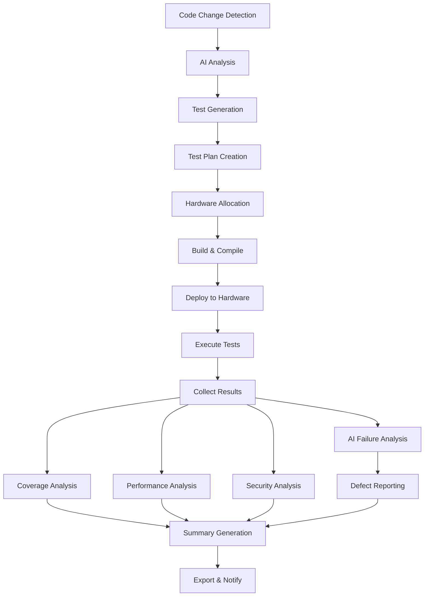

# Workflow Type Analysis for Agentic AI Testing System

## Executive Summary

This document analyzes the workflow patterns used in the Agentic AI Testing System and provides recommendations for workflow visualization approaches. The system implements a **Hybrid CI/CD Pipeline with Event-Driven Orchestration** pattern, combining multiple workflow paradigms for comprehensive test automation.

---

## Primary Workflow Type: Hybrid CI/CD Pipeline with Event-Driven Orchestration

### Overview

The Agentic AI Testing System combines four distinct workflow patterns to create a robust, scalable testing infrastructure:

1. **CI/CD Pipeline Workflow** (Primary)
2. **Event-Driven Workflow**
3. **Orchestration Workflow (DAG)**
4. **State Machine Workflow**

---

## 1. CI/CD Pipeline Workflow (Primary Pattern)

### Description

The system follows a classic Continuous Integration/Continuous Deployment pipeline structure with automated progression through sequential stages.

### Pipeline Flow

```
Code Change → AI Analysis → Test Generation → Test Plan Creation → 
Hardware Allocation → Build/Compile → Deploy → Execute → 
Analyze → Report Defect → Generate Summary
```

### Characteristics

**Why This Pattern Fits:**
- ✅ Triggered by code commits/pull requests via VCS webhooks
- ✅ Sequential stages with clear dependencies
- ✅ Automated progression through stages
- ✅ Quality gates at each phase (compilation, deployment verification, test execution)
- ✅ Feedback loops to developers via notifications and VCS status updates
- ✅ Artifact management (build outputs, test results, logs)
- ✅ Rollback capabilities on failure

**Key Benefits:**
- Predictable execution flow
- Easy to understand and debug
- Industry-standard approach
- Well-supported by tooling
- Clear success/failure criteria

**Implementation in System:**
- VCS webhook triggers (GitHub, GitLab)
- Sequential stage execution
- Artifact passing between stages
- Status reporting back to VCS
- Automated notifications

---

## 2. Event-Driven Workflow

### Description

The system reacts to events and triggers appropriate actions asynchronously, enabling real-time responsiveness and parallel processing.

### Event Flow Architecture

```
Event Source → Event Handler → Action → Result → Notification
```

### Key Events and Triggers

| Event | Trigger | Action |
|-------|---------|--------|
| Code Commit | VCS Webhook | Trigger AI test generation |
| Test Plan Created | API Call | Trigger hardware allocation |
| Build Complete | Build Server | Trigger deployment |
| Deployment Complete | Deployment Service | Trigger test execution |
| Test Failure | Execution Engine | Trigger defect creation |
| Execution Complete | Test Runner | Trigger analysis pipeline |
| Critical Failure | Analyzer | Send immediate alerts |
| Summary Generated | Report Service | Update dashboard & notify |

### Characteristics

**Why This Pattern Fits:**
- ✅ Asynchronous processing for non-blocking operations
- ✅ WebSocket connections for real-time updates
- ✅ Event-driven notification system (Email, Slack, Teams)
- ✅ Webhook integrations with external systems
- ✅ Decoupled components communicating via events
- ✅ Scalable architecture for high-volume testing

**Key Benefits:**
- Real-time responsiveness
- Loose coupling between components
- Horizontal scalability
- Fault tolerance
- Flexible integration points

**Implementation in System:**
- WebSocket for real-time dashboard updates
- Webhook handlers for VCS integration
- Event bus for inter-component communication
- Notification service for multi-channel alerts
- Queue-based task distribution

---

## 3. Orchestration Workflow (DAG - Directed Acyclic Graph)

### Description

The workflow is structured as a Directed Acyclic Graph with clear dependencies and support for parallel execution where appropriate.

### Workflow DAG Structure



### Characteristics

**Why This Pattern Fits:**
- ✅ Clear dependencies between stages (no stage executes before prerequisites)
- ✅ Parallel execution support (analysis stages run concurrently)
- ✅ No cycles (acyclic) - prevents infinite loops
- ✅ Directed flow - clear progression path
- ✅ Conditional branching (skip deployment on build failure)
- ✅ Resource optimization through parallel processing

**Parallel Execution Opportunities:**
1. **Analysis Phase:**
   - AI Failure Analysis
   - Coverage Analysis
   - Performance Analysis
   - Security Analysis
   
   *All can run simultaneously on the same test results*

2. **Multi-Environment Testing:**
   - QEMU x86_64 execution
   - QEMU ARM64 execution
   - Physical board execution
   
   *Can run in parallel on different hardware*

3. **Multi-Architecture Builds:**
   - x86_64 compilation
   - ARM64 compilation
   - RISC-V compilation
   
   *Can compile simultaneously on build farm*

**Key Benefits:**
- Optimal resource utilization
- Reduced total execution time
- Clear dependency management
- Easy to visualize and understand
- Supports complex workflows

**Implementation in System:**
- Orchestrator manages task dependencies
- Priority-based scheduling
- Parallel execution engine
- Resource allocation across environments
- Dynamic rescheduling on failures

---

## 4. State Machine Workflow

### Description

Each test execution progresses through well-defined states with clear transition rules and conditions.

### State Transition Diagram

```
┌─────────┐
│ Created │
└────┬────┘
     │
     ▼
┌─────────┐
│  Queued │◄─────────┐
└────┬────┘          │
     │               │ (Retry)
     ▼               │
┌───────────┐        │
│ Scheduled │        │
└─────┬─────┘        │
      │              │
      ▼              │
┌──────────┐         │
│ Building │─────────┤ (Build Failed)
└────┬─────┘         │
     │               │
     ▼               │
┌───────────┐        │
│ Deploying │────────┤ (Deploy Failed)
└─────┬─────┘        │
      │              │
      ▼              │
┌─────────┐          │
│ Running │──────────┤ (Execution Failed)
└────┬────┘          │
     │               │
     ▼               │
┌───────────┐        │
│ Analyzing │────────┘
└─────┬─────┘
      │
      ▼
┌──────────┐
│ Complete │
└──────────┘
      │
      ├──► Success
      ├──► Failed
      └──► Cancelled
```

### State Definitions

| State | Description | Next States | Actions |
|-------|-------------|-------------|---------|
| Created | Test plan initialized | Queued | Validate configuration |
| Queued | Waiting for resources | Scheduled, Cancelled | Monitor queue position |
| Scheduled | Resources allocated | Building | Reserve hardware |
| Building | Compiling test artifacts | Deploying, Queued (retry) | Cross-compile for target |
| Deploying | Transferring to hardware | Running, Queued (retry) | Copy artifacts, install deps |
| Running | Executing tests | Analyzing, Queued (retry) | Run tests, capture logs |
| Analyzing | Processing results | Complete | AI analysis, coverage, perf |
| Complete | Finished | N/A | Generate summary, notify |

### Characteristics

**Why This Pattern Fits:**
- ✅ Clear state transitions with defined rules
- ✅ Status tracking at each stage
- ✅ Retry logic for transient failures
- ✅ State-based decision making
- ✅ Audit trail of state changes
- ✅ Easy to monitor and debug

**Key Benefits:**
- Predictable behavior
- Easy error handling
- Clear status reporting
- Supports retry logic
- Audit and compliance

**Implementation in System:**
- State stored in database
- State transition validation
- Event emission on state change
- Retry policies per state
- State-based UI updates

---

## Workflow Visualization Recommendations

### Current Implementation: Pipeline View ✅

**Status:** Implemented in `dashboard/src/pages/WorkflowDiagram.tsx`

**Strengths:**
- Clear stage progression
- Interactive stage details
- Status indicators per stage
- Best for user understanding
- Good for onboarding

**Use Cases:**
- System overview
- Training new team members
- Executive dashboards
- Process documentation

---

### Recommended Additional Visualizations

### 1. Sankey Diagram (Flow-Based Visualization)

**Purpose:** Show the flow of tests through the system with volume metrics

**Visual Representation:**
```
[1000 Tests Generated] ──────────────────────────────┐
                                                      │
                                                      ▼
                                            [950 Tests Compiled]
                                                      │
                                    ┌─────────────────┼─────────────────┐
                                    │                 │                 │
                                    ▼                 ▼                 ▼
                            [300 QEMU x86]    [300 QEMU ARM]    [350 Physical]
                                    │                 │                 │
                                    ▼                 ▼                 ▼
                            [285 Passed]      [290 Passed]      [330 Passed]
                            [15 Failed]       [10 Failed]       [20 Failed]
```

**Key Features:**
- Width represents volume (number of tests)
- Shows where tests pass/fail
- Visualizes bottlenecks
- Identifies drop-off points

**Best For:**
- Capacity planning
- Bottleneck identification
- Success rate analysis
- Resource optimization

**Implementation Priority:** Medium

---

### 2. Swimlane Diagram (Actor-Based Visualization)

**Purpose:** Show responsibilities across system components

**Visual Representation:**
```
┌─────────────────────────────────────────────────────────────────────┐
│ AI Generator  │ [Analyze Code] → [Generate Tests] → [Validate]     │
├─────────────────────────────────────────────────────────────────────┤
│ Orchestrator  │ [Schedule] → [Allocate Resources] → [Monitor]      │
├─────────────────────────────────────────────────────────────────────┤
│ Build Server  │ [Compile x86] → [Compile ARM] → [Verify Artifacts] │
├─────────────────────────────────────────────────────────────────────┤
│ Executor      │ [Deploy] → [Run Tests] → [Collect Results]         │
├─────────────────────────────────────────────────────────────────────┤
│ Analyzer      │ [AI Analysis] → [Coverage] → [Performance]         │
├─────────────────────────────────────────────────────────────────────┤
│ Reporter      │ [Create Defects] → [Generate Summary] → [Notify]   │
└─────────────────────────────────────────────────────────────────────┘
```

**Key Features:**
- Clear component responsibilities
- Shows handoffs between components
- Identifies communication patterns
- Highlights integration points

**Best For:**
- Architecture documentation
- Debugging integration issues
- Team coordination
- System design reviews

**Implementation Priority:** Low

---

### 3. Gantt Chart / Timeline View (Time-Based Visualization) ⭐ **RECOMMENDED**

**Purpose:** Show execution timeline and duration of each stage

**Visual Representation:**
```
Stage                 0min    15min   30min   45min   60min   75min   90min
─────────────────────────────────────────────────────────────────────────────
AI Analysis           [████]
Test Generation            [████████]
Build x86                       [██████████]
Build ARM                       [██████████]
Deploy QEMU                              [████]
Deploy Physical                               [██████]
Execute QEMU                                   [████████████████]
Execute Physical                                    [████████████████████]
Coverage Analysis                                                [████]
Performance Analysis                                             [██████]
AI Failure Analysis                                              [████████]
Defect Reporting                                                      [██]
Summary Generation                                                     [████]
```

**Key Features:**
- Duration of each stage
- Parallel execution visualization
- Resource utilization over time
- Bottleneck identification
- Critical path analysis

**Best For:**
- Performance optimization
- Capacity planning
- SLA monitoring
- Identifying slow stages
- Resource allocation

**Implementation Priority:** ⭐ **HIGH** - Most valuable addition

**Benefits:**
- Clearly shows the 45-minute build/compile stage
- Identifies parallel execution opportunities
- Helps optimize resource allocation
- Shows critical path through workflow

---

### 4. Kanban Board (Status-Based Visualization)

**Purpose:** Show current status of all test executions

**Visual Representation:**
```
┌────────────┬────────────┬────────────┬────────────┬────────────┐
│   Queued   │  Building  │  Running   │ Analyzing  │  Complete  │
├────────────┼────────────┼────────────┼────────────┼────────────┤
│ TestPlan-1 │ TestPlan-5 │ TestPlan-8 │ TestPlan-12│ TestPlan-15│
│ TestPlan-2 │ TestPlan-6 │ TestPlan-9 │ TestPlan-13│ TestPlan-16│
│ TestPlan-3 │ TestPlan-7 │ TestPlan-10│ TestPlan-14│ TestPlan-17│
│ TestPlan-4 │            │ TestPlan-11│            │ TestPlan-18│
│            │            │            │            │ TestPlan-19│
├────────────┼────────────┼────────────┼────────────┼────────────┤
│   4 items  │   3 items  │   3 items  │   2 items  │   5 items  │
└────────────┴────────────┴────────────┴────────────┴────────────┘
```

**Key Features:**
- Real-time status overview
- Work-in-progress limits
- Queue depth visibility
- Drag-and-drop prioritization
- Team workload visualization

**Best For:**
- Daily operations
- Test engineers
- Queue management
- Priority adjustments
- Workload balancing

**Implementation Priority:** Medium

---

### 5. Dependency Graph (Relationship-Based Visualization)

**Purpose:** Show test dependencies and failure propagation

**Visual Representation:**
```
                    [Kernel Core Tests]
                           │
            ┌──────────────┼──────────────┐
            │              │              │
            ▼              ▼              ▼
    [Memory Tests]  [Scheduler Tests] [I/O Tests]
            │              │              │
            └──────────────┼──────────────┘
                           │
                           ▼
                  [Integration Tests]
```

**Key Features:**
- Test dependencies
- Failure impact analysis
- Prerequisite tracking
- Blocked test identification
- Critical path highlighting

**Best For:**
- Debugging test failures
- Understanding test relationships
- Impact analysis
- Test organization
- Dependency management

**Implementation Priority:** Low

---

## Multi-View Implementation Strategy

### Recommended Approach: Tabbed Interface

Implement multiple workflow views accessible via tabs in the WorkflowDiagram page:

```typescript
<Tabs defaultActiveKey="pipeline">
  <TabPane tab="Pipeline View" key="pipeline">
    <PipelineWorkflowView />  {/* Current implementation */}
  </TabPane>
  
  <TabPane tab="Timeline View" key="timeline">
    <TimelineWorkflowView />  {/* Gantt chart - HIGH PRIORITY */}
  </TabPane>
  
  <TabPane tab="Real-Time Status" key="realtime">
    <KanbanWorkflowView />    {/* Kanban board - MEDIUM PRIORITY */}
  </TabPane>
  
  <TabPane tab="Flow Analysis" key="flow">
    <SankeyWorkflowView />    {/* Sankey diagram - MEDIUM PRIORITY */}
  </TabPane>
  
  <TabPane tab="Dependencies" key="dependencies">
    <DependencyGraphView />   {/* Dependency graph - LOW PRIORITY */}
  </TabPane>
</Tabs>
```

### View Selection Criteria

| View Type | Use Case | User Persona | Priority |
|-----------|----------|--------------|----------|
| Pipeline | System overview, training | Managers, New users | ✅ Implemented |
| Timeline | Performance analysis | Performance engineers | ⭐ HIGH |
| Kanban | Daily operations | Test engineers | Medium |
| Sankey | Capacity planning | DevOps, Architects | Medium |
| Dependency | Debugging | Developers, QA | Low |

---

## Implementation Recommendations

### Phase 1: Timeline View (Immediate) ⭐

**Why First:**
- Highest value for identifying bottlenecks
- Shows the 45-minute build stage clearly
- Helps optimize resource allocation
- Critical for performance tuning

**Implementation:**
- Use a Gantt chart library (e.g., `react-gantt-chart`, `dhtmlx-gantt`)
- Show stage durations from execution history
- Highlight parallel execution
- Color-code by status (success/failure)
- Add zoom controls for different time scales

**Estimated Effort:** 2-3 days

---

### Phase 2: Kanban Board (Short-term)

**Why Second:**
- Useful for daily operations
- Real-time status overview
- Easy to implement with existing data
- High user engagement

**Implementation:**
- Use `react-beautiful-dnd` for drag-and-drop
- Connect to real-time WebSocket updates
- Add filtering and search
- Support priority reordering
- Show queue depth metrics

**Estimated Effort:** 2-3 days

---

### Phase 3: Sankey Diagram (Medium-term)

**Why Third:**
- Valuable for capacity planning
- Shows test flow and drop-off
- Helps identify bottlenecks
- Good for executive reporting

**Implementation:**
- Use D3.js or `react-vis` for Sankey charts
- Aggregate historical data
- Show volume at each stage
- Highlight failure points
- Add time range filters

**Estimated Effort:** 3-4 days

---

### Phase 4: Additional Views (Long-term)

**Swimlane and Dependency views:**
- Lower priority
- Implement based on user feedback
- Consider as enhancement features

**Estimated Effort:** 2-3 days each

---

## Technical Architecture

### Data Requirements

Each visualization requires different data structures:

```typescript
// Pipeline View (Current)
interface PipelineStage {
  id: string;
  title: string;
  status: 'waiting' | 'process' | 'finish' | 'error';
  progress?: number;
}

// Timeline View (Gantt)
interface TimelineTask {
  id: string;
  name: string;
  start: Date;
  end: Date;
  duration: number;
  dependencies: string[];
  status: 'success' | 'failure' | 'running';
  resource?: string;
}

// Kanban View
interface KanbanCard {
  id: string;
  title: string;
  status: 'queued' | 'building' | 'running' | 'analyzing' | 'complete';
  priority: number;
  assignee?: string;
  createdAt: Date;
}

// Sankey View
interface SankeyNode {
  id: string;
  name: string;
}

interface SankeyLink {
  source: string;
  target: string;
  value: number; // Volume of tests
}

// Dependency View
interface DependencyNode {
  id: string;
  name: string;
  type: 'test' | 'suite' | 'plan';
  status: 'pass' | 'fail' | 'blocked';
}

interface DependencyEdge {
  from: string;
  to: string;
  type: 'requires' | 'blocks';
}
```

### API Endpoints Needed

```typescript
// Timeline data
GET /api/v1/workflow/timeline?planId={id}&timeRange={range}

// Kanban data
GET /api/v1/workflow/kanban?status={status}
WS  /api/v1/workflow/kanban/updates

// Sankey data
GET /api/v1/workflow/flow?timeRange={range}

// Dependency data
GET /api/v1/workflow/dependencies?planId={id}
```

---

## Performance Considerations

### Data Volume

- **Pipeline View:** Low data volume, static structure
- **Timeline View:** Medium data volume, historical queries
- **Kanban View:** Low data volume, real-time updates
- **Sankey View:** High data volume, aggregation required
- **Dependency View:** Medium data volume, graph traversal

### Optimization Strategies

1. **Caching:**
   - Cache historical timeline data
   - Cache aggregated Sankey data
   - Invalidate on new executions

2. **Pagination:**
   - Limit timeline to recent executions
   - Paginate Kanban cards
   - Lazy-load dependency graphs

3. **Real-Time Updates:**
   - Use WebSocket for Kanban updates
   - Throttle timeline refreshes
   - Batch update notifications

4. **Data Aggregation:**
   - Pre-aggregate Sankey data
   - Use materialized views
   - Background processing for analytics

---

## Success Metrics

### Key Performance Indicators

| Metric | Target | Measurement |
|--------|--------|-------------|
| Page Load Time | < 2 seconds | Time to interactive |
| Real-Time Update Latency | < 500ms | WebSocket message delay |
| Data Refresh Rate | 2-5 seconds | Polling/push interval |
| User Engagement | > 70% | Views per session |
| Error Rate | < 1% | Failed renders |

### User Adoption Metrics

- View usage distribution
- Time spent per view
- Feature utilization
- User feedback scores
- Support ticket reduction

---

## Conclusion

The Agentic AI Testing System implements a sophisticated **Hybrid CI/CD Pipeline with Event-Driven Orchestration** workflow that combines:

1. ✅ **CI/CD Pipeline** for structured progression
2. ✅ **Event-Driven** for real-time responsiveness
3. ✅ **DAG Orchestration** for parallel execution
4. ✅ **State Machine** for predictable behavior

### Immediate Next Steps

1. ⭐ **Implement Timeline/Gantt View** (HIGH PRIORITY)
   - Shows build/compile stage duration clearly
   - Identifies bottlenecks
   - Optimizes resource allocation
   - Estimated: 2-3 days

2. **Enhance Current Pipeline View**
   - Add more interactive elements
   - Show real-time metrics
   - Improve mobile responsiveness

3. **Gather User Feedback**
   - Survey users on visualization needs
   - Track usage patterns
   - Prioritize based on demand

### Long-Term Vision

Create a comprehensive workflow visualization suite that serves all user personas:
- **Executives:** High-level pipeline and Sankey views
- **Test Engineers:** Kanban and real-time monitoring
- **Performance Engineers:** Timeline and bottleneck analysis
- **Developers:** Dependency graphs and failure analysis
- **DevOps:** Resource utilization and capacity planning

---

## Appendix: Workflow Pattern Comparison

| Pattern | Strengths | Weaknesses | Best For |
|---------|-----------|------------|----------|
| CI/CD Pipeline | Clear progression, industry standard | Can be rigid, sequential bottlenecks | Automated testing workflows |
| Event-Driven | Scalable, decoupled, real-time | Complex debugging, eventual consistency | High-volume, async operations |
| DAG Orchestration | Parallel execution, clear dependencies | Complex setup, resource management | Complex workflows with dependencies |
| State Machine | Predictable, easy to debug | Can be verbose, state explosion | Status tracking, retry logic |

---

## Document Metadata

- **Created:** 2026-01-15
- **Version:** 1.0
- **Author:** Kiro AI Assistant
- **Last Updated:** 2026-01-15
- **Status:** Final
- **Related Documents:**
  - WORKFLOW_DIAGRAM_ENHANCEMENT_COMPLETE.md
  - .kiro/specs/complete-test-workflow/requirements.md
  - dashboard/src/pages/WorkflowDiagram.tsx
